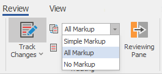
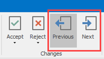
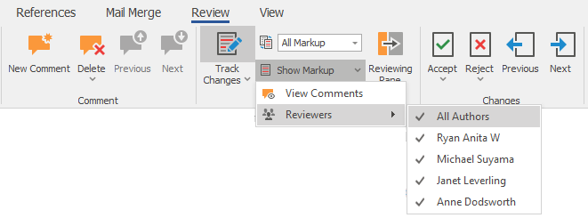
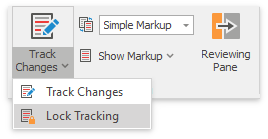

# Enable Track Changes

The **Track Changes** feature allows you to keep track of the changes.

## Turn On Track Changes

On the **Review** [tab](../text-editor-ui/ribbon-interface.md), in the **Tracking** group, click the **Track Changes** button.

When Track Changes is turned on, red lines in the margin indicate the changes.

When you turn of Track Changes, the Rich Text Editor does not mark changes but displays the lines in the document.

## View Changes

Use the **Display for Review** drop-down list to specify how to display changes in the document. On the **Review** [tab](../text-editor-ui/ribbon-interface.md), in the **Tracking** group, open the **Display for Review** list.

Select one of the following modes:

* **All Markup** - displays revisions in details.
    

* **Simple Markup** - displays revisions indicated by a red line in the margin.
    

* **No Markup** - displays the document without any visible revisions (as if all revisions are accepted).
    

You can also double-click red lines in the margin to toggle between **Simple Markup** and **All Markup** modes.

>[!NOTE]
> Rich Text Editor does not display changes in the Reviewing Pane or in balloons.

Use **Next** and **Previous** buttons on the **Changes** ribbon group to switch between changes.

### View Changes from Specific Authors

On the **Review** [tab](../text-editor-ui/ribbon-interface.md), in the **Tracking** group, open the **Show Markup** list. Select users whose changes you wish to display in the **Reviewers** list.

## Lock Tracking

You can set a password that prevents users from disabling Track Changes. In the **Tracking** group on the **Review** [tab](../text-editor-ui/ribbon-interface.md), click **Lock Tracking** in the **Track Changes** drop-down list.

Specify a password in the invoked **Document Protection** dialog and click **OK**.

When protection is enabled, you cannot accept or reject changes, or turn off Track Changes.
