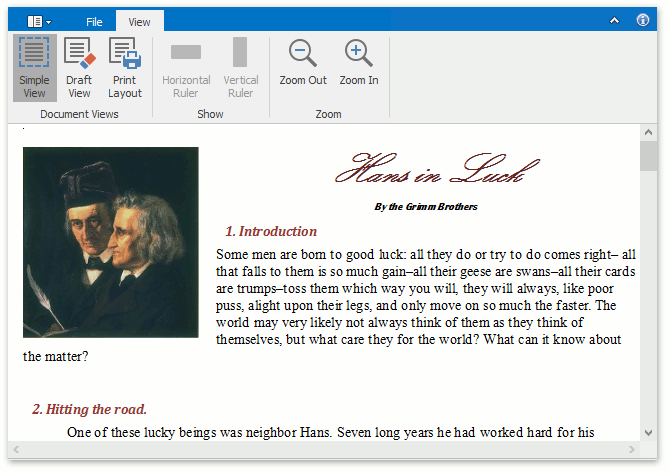
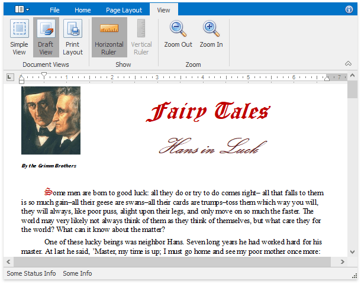
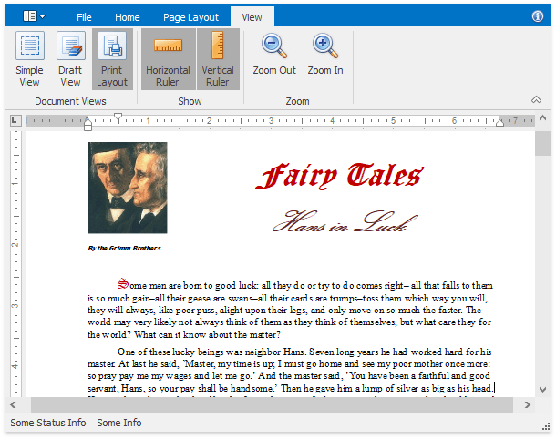
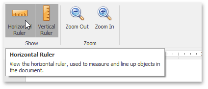
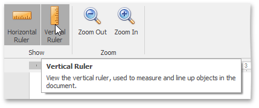

# Switch Document Views
The **Rich Edit** control provides a number of document views that you can switch depending on what you want to do.

## Simple View
A simple view shows a document without a page layout. This view can be useful when you want to concentrate on text editing.

To enable this view, on the **View** [ tab](../text-editor-ui/ribbon-interface.md), in the **Document Views** group, click the **Simple View** button.

## Draft View
The draft view is a view without pagination. It does not display complex formatting features that are most appropriate to the page layout. You can use it for the simplest representation of the document, as well as quick text editing.

To enable this view, on the **View** [ tab](../text-editor-ui/ribbon-interface.md), in the **Document Views** group, click the **Draft View** button.

In draft view the horizontal ruler is available. To show or hide it, click **Horizontal Ruler** on the **View** ribbon tab.

.png)

## Print Layout View
The print layout view is intended to display all formatting in the document, including complex formatting, and can be used to preview the document printout.

To enable this view, on the **View** [ tab](../text-editor-ui/ribbon-interface.md), in the **Document Views** group, click the **Print Layout** button.

When the print layout view is active, the horizontal and vertical rulers are available. To show or hide horizontal and vertical rulers, on the **View** tab, in the **Show** group, click the **Horizontal Ruler** and **Vertical Ruler** buttons, respectively.

                  
