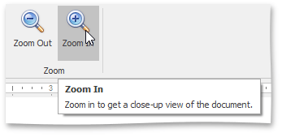

You can zoom in and out of a document in the following ways:
* On the **View** [ tab](../../../../interface-elements-for-desktop/articles/rich-text-editor/text-editor-ui/ribbon-interface.md), in the **Zoom** group, click the **Zoom In** and **Zoom Out** buttons.
	
	 
* Hold the **CTRL** button and rotate your mouse wheel.