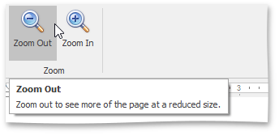
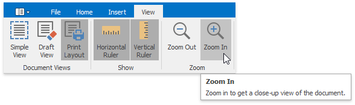

# Zoom a Document
You can zoom in and out of a document in the following ways:
* On the **View** [ tab](../text-editor-ui/ribbon-interface.md), in the **Zoom** group, click the **Zoom In** and **Zoom Out** buttons.
	
	 
* Hold the **CTRL** button and rotate your mouse wheel.