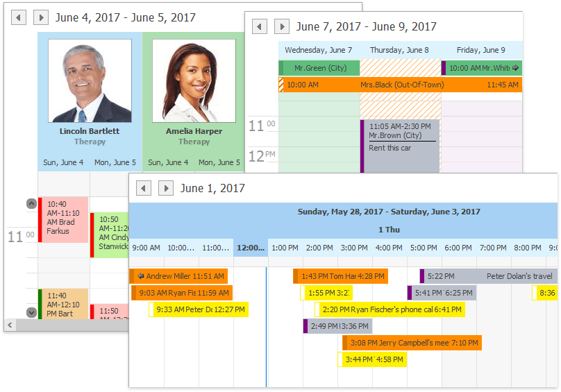

# Scheduler
This section describes the capabilities provided by the Scheduler, which is used for scheduling/calendar activities.

**Scheduler UI**
* [Toolbars](scheduler/scheduler-ui/toolbars.md)
* [Ribbon Interface](scheduler/scheduler-ui/ribbon-interface.md)

**Appointment  Management**
* [Create Appointments](scheduler/appointment-management/create-appointments.md)
* [Edit Appointments](scheduler/appointment-management/edit-appointments.md)
* [Manage Reminders](scheduler/appointment-management/manage-reminders.md)
* [Delete Appointments](scheduler/appointment-management/delete-appointments.md)
* [Restrictions for Operations with Appointments](scheduler/appointment-management/restrictions-for-operations-with-appointments.md)

**Layout Customization**
* [Switch Scheduler Views](scheduler/layout-customization/switch-scheduler-views.md)
* [Scheduler Grouping](scheduler/layout-customization/scheduler-grouping.md)
* [Zoom the Scheduling Area](scheduler/layout-customization/zoom-the-scheduling-area.md)

**Selection and Navigation**
* [Navigate Dates in the Scheduler](scheduler/selection-and-navigation/navigate-dates-in-the-scheduler.md)
* [Navigate Scheduler Resources](scheduler/selection-and-navigation/navigate-scheduler-resources.md)
* [Navigate Scheduler Time Cells](scheduler/selection-and-navigation/navigate-scheduler-time-cells.md)
* [Scheduler Navigation Buttons](scheduler/selection-and-navigation/scheduler-navigation-buttons.md)
* [Scheduler 'More' Buttons](scheduler/selection-and-navigation/scheduler-more-buttons.md)

**Printing**
* [Printing](scheduler/printing.md)