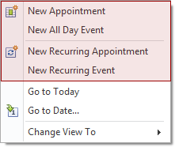
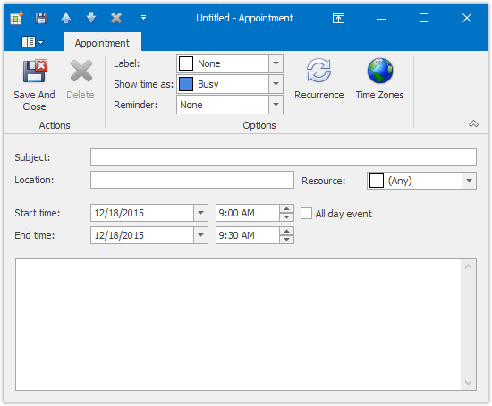
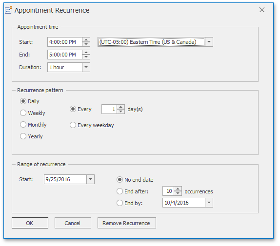
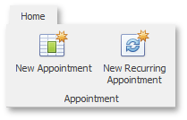

# Create Appointments
## Context Menu
The following items are available in the context menu, invoked when you right-click any region of the Scheduler (except for areas covered by appointments).

1. **New Appointment**
	
	Invokes the **Edit Appointment** dialog.
	
	The **Start time** and **End time** values are initially set to the lower and upper boundaries of the current date and time selection.
	
	
	
	Fill in other fields, if necessary. For example, use the large text box at the bottom of the dialog to enter text, which will be shown as an appointment's description in a **Day** or a **Work Week** [views](../layout-customization/switch-scheduler-views.md).
	
	You can also select the **Reminder** check box to enable appointment notifications (see [Manage Reminders](manage-reminders.md)).
2. **New All Day Event**
	
	Invokes the **Edit Event** dialog, which is used to create a new all-day appointment (also called 'all-day event'). The dialog is identical to **Edit Appointment** (shown above), except that in this case, the **All day event** option is checked, its time range is measured in days (not hours) and marked as **Free**. The appointment can be transformed into an all-day event and vice-versa by checking this box.
3. **New Recurring Appointment**
	
	All appointments maintained by the scheduler can either be simple (non-recurring - i.e., they happen only once), or recurring - occurring multiple times within a specified time interval.
	
	Selecting this menu item invokes the **Edit Appointment** dialog, used to create a new appointment, and also invokes the **Appointment Recurrence** dialog, which allows the recurrence pattern to be specified for the new appointment.
	
	
4. **New Recurring Event**
	
	Selecting this menu item invokes the **Event** editor dialog used to create a new all-day appointment, and also invokes the **Appointment Recurrence** dialog, which allows the recurrence pattern to be specified for the new event.

## Bar or Ribbon Interface
If a scheduler is provided with the Bar or Ribbon interface, you can create new appointments (simple and recurring) using the **New Appointment** and **New Recurring Appointment** buttons on the **Appointment** [toolbar](../scheduler-ui/toolbars.md) or [Ribbon page group](../scheduler-ui/ribbon-interface.md). These buttons invoke the **Edit Appointment** and **Appointment Recurrence** dialogs respectively.

| Create a new appointment via Bar interface | Create a new appointment via Ribbon interface |
|---|---|
|  |  |

## Keyboard Shortcuts and Mouse Operations
| Action | Description |
|---|---|
| An alphanumeric key or ENTER | Pressing an alphanumeric key or ENTER invokes an in-place editor where you can type the subject of a new appointment occupying the currently selected area. Once you have typed your appointment's subject, you can either create and save the appointment by pressing **ENTER** or changing the focus, or cancel the operation by pressing **ESC**. The type of the created appointment depends on the selected time cell(s). When typing is done in **Day** or **Work-Week** view, the appointment is created with the time interval starting with the earliest time of the selected cells and ending with the latest, and the time is marked as **Busy**. If an all-day area is selected, then an all-day appointment is created with the time marked as **Free**. When the scheduler display mode is **Week** or **Month** view, the appointment is created with the start time set to 12 AM of the first selected day, and the end time is set to 12 AM of the day following the last selected day. |
| Double-click | Double-clicking within a scheduler view's time cell that does not contain any appointments invokes the **Edit Appointment** dialog described above. |
| CTRL+N | Pressing CTRL+N invokes the **Edit Appointment** dialog. Then this dialog can be used to create a new appointment. |
| Dragging an appointment while holding CTRL | This action creates a copy of the selected appointment and moves it, leaving the original appointment intact. |