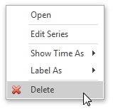
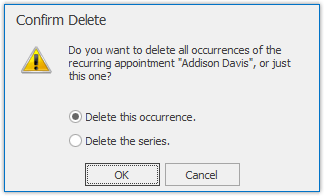
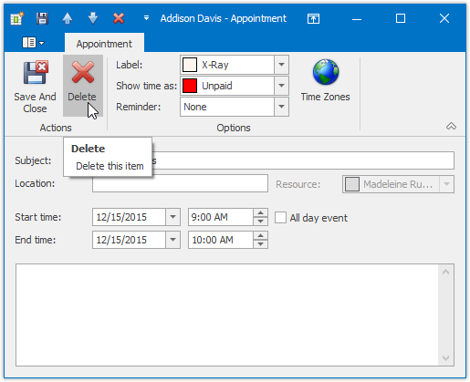
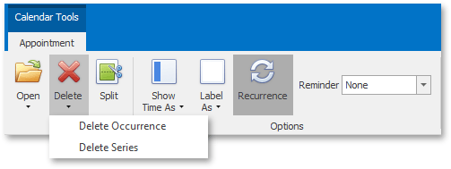

# Delete Appointments
## Context Menu
You can delete the selected appointment using the **Delete** item of the context menu, which is invoked when an appointment is right-clicked.

Selecting this item removes the current appointment. If the current appointment is recurring, then the **Confirm Delete** dialog is invoked.

## Edit Appointment Dialog
When the appointment is being edited via the **Edit Appointment** dialog, in order to delete the corresponding appointment (or series of recurring appointments) click the **Delete** button of this dialog.

## Bar or Ribbon Interface
If a scheduler is provided with the [Bar](../scheduler-ui/toolbars.md) or [Ribbon](../scheduler-ui/ribbon-interface.md) interface, you can delete appointments (simple and recurring) using the **Delete** button on the **Actions** toolbar or Ribbon page group. If the appointment to be deleted is recurring, clicking this button invokes the drop-down list allowing you to decide whether the whole series of recurring appointments should be deleted or just a particular occurrence.

| Delete an appointment via Bar interface | Delete an appointment via Ribbon interface |
|---|---|
|  |  |

## Keyboard Shortcuts
The **DELETE** key or the **CTRL+D** keyboard shortcut can be used to delete the selected appointment(s).