# Edit Appointments
You can modify existing appointments in the following ways:
* [using the appointment context menu](#contextmenu)
* [using the built-in dialogs](#dialogs)
* [using the in-place editor](#inplaceediting)
* [via the Bar or Ribbon interface](#barribbonui)
* [via keyboard shortcuts and mouse operations](#keyboardshortcutsmouseoperations)

> [!NOTE]
> Access to some operations may be [restricted](restrictions-for-operations-with-appointments.md).

## <a name="contextmenu"/>Context Menu
After an appointment has been right-clicked, the appointment context menu is invoked. The **Show Time As** and **Label As** items are used to alter an appointment. They allow for the changing of basic visual characteristics of an appointment - status and label.

| Change the appointment status | Change the appointment label |
|---|---|
| 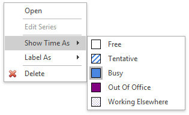 | 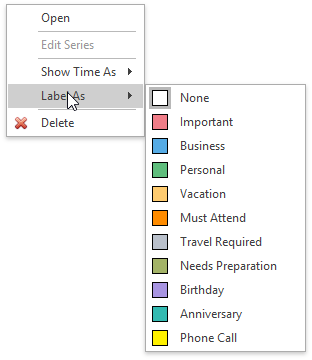 |

## <a name="dialogs"/>Edit Appointment and Appointment Recurrence Dialogs
* **Edit a Simple Appointment**
	
	You can edit properties of a simple (non-recurring) appointment via the **Edit Appointment** dialog that can be invoked via the appointment context menu, [Bar](../scheduler-ui/toolbars.md) or [Ribbon](../scheduler-ui/ribbon-interface.md) interface, keyboard shortcuts and mouse operations.
	
	| Context Menu | Toolbar | Ribbon Page Group | Keyboard Shortcuts and Mouse Operations | Invoked Edit Appointment Dialog |
	|---|---|---|---|---|
	| 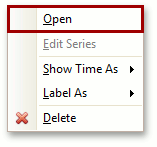 | 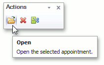 | 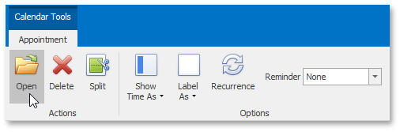 | Double-click the appointment to be edited or select an appointment, and then press **ENTER** or **CTRL-O**. | 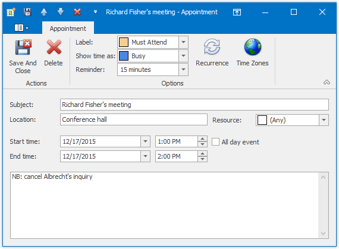 |
* **Edit a Particular Occurrence in a Series**
	
	The same dialog is used to edit a particular occurrence in the series of recurring appointments (recurring appointments are marked with a  sign). If you select a recurring appointment, and click **Open** in the appointment context menu or the **Open Occurrence** button on the **Action** [toolbar](../scheduler-ui/toolbars.md) or [Ribbon page group](../scheduler-ui/ribbon-interface.md), the **Edit Appointment** dialog is invoked to allow for the editing of the current appointment only, but not its entire series.
	
	| Context Menu | Toolbar | Ribbon Page Group | Keyboard Shortcuts and Mouse Operations | Invoked Edit Appointment Dialog |
	|---|---|---|---|---|
	| 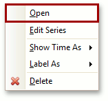 | 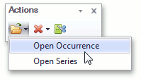 | 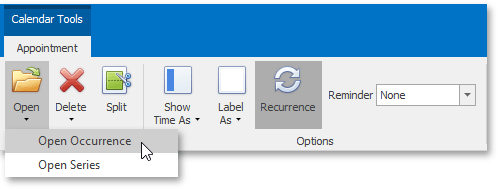 | Double-click an appointment to be edited or select an appointment, and then press **ENTER** or **CTRL-O**. |  |
	
	The appointment with changed properties still belongs to the series, but is marked with an "exception". The visual indicator of an exception is the crossed recurrence sign . To replace an exceptional appointment with the regular occurrence in the chain of recurring appointments, click the **Restore Default State** item in the appointment's context menu.
* **Edit a Series of Recurring Appointments**
	
	To edit an entire series of recurring appointments (a pattern appointment), it is necessary to select a recurring appointment, and click **Edit Series** in the appointment context menu or select the **Open Series** item from the **Open** drop-down list on the **Actions** [toolbar](../scheduler-ui/toolbars.md) or [Ribbon page group](../scheduler-ui/ribbon-interface.md). In this instance, the **Edit Appointment** dialog is shown with a different window icon. Time fields are inaccessible.
	
	| Context Menu | Toolbar | Ribbon Page Group | Invoked Edit Appointment Dialog |
	|---|---|---|---|
	| 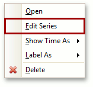 | 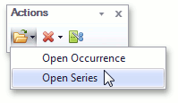 | 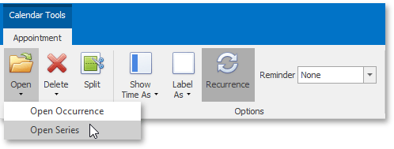 | 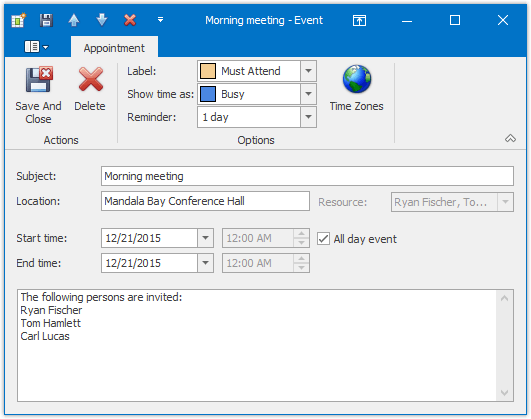 |
	
	The recurrence pattern can be edited via the **Appointment Recurrence** dialog. You can invoke it by clicking the **Recurrence** button of the **Edit Appointment** dialog, or using the **Recurrence** button on the **Options** [toolbar](../scheduler-ui/toolbars.md) or [Ribbon page group](../scheduler-ui/ribbon-interface.md).
	
	| Edit Appointment Dialog | Toolbar | Ribbon Page Group | Invoked Appointment Recurrence Dialog |
	|---|---|---|---|
	|  | 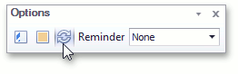 | 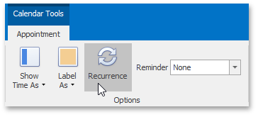 | 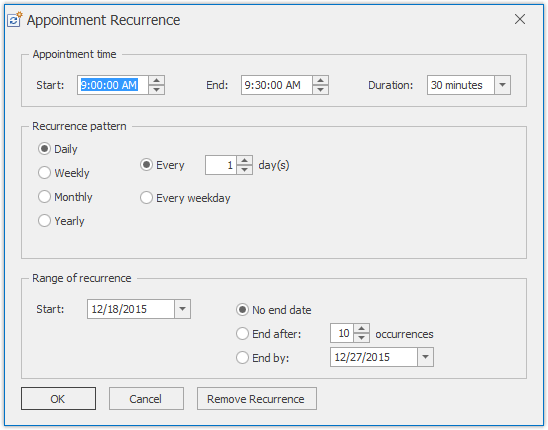 |

## <a name="inplaceediting"/>In-place Editing
A single mouse click within an appointment, or pressing **F2**, invokes the in-place editor, which you can use to edit the selected appointment's **Subject**. It is illustrated in the following picture.

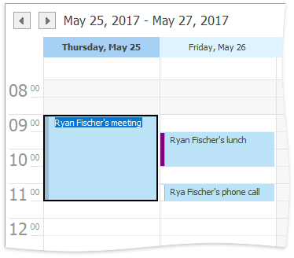

By default, you can close the editor by pressing **Enter** (to save modifications) or **Escape** (to cancel modifications).

## <a name="barribbonui"/>Bar or Ribbon Interface
If a scheduler is provided with the [Bar](../scheduler-ui/toolbars.md) or [Ribbon](../scheduler-ui/ribbon-interface.md) interface, you can modify appointment properties (status, label, recurrence and reminder)  using the **Options** toolbar or Ribbon page group, which is active when an appointment is selected.

| Modify an appointment via the Bar interface | Modify an appointment via the Ribbon interface |
|---|---|
| 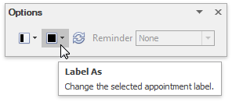 | 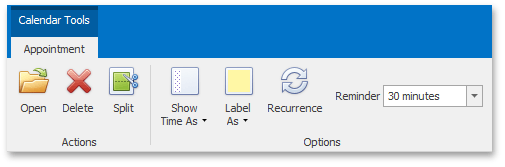 |

## <a name="keyboardshortcutsmouseoperations"/>Keyboard Shortcuts and Mouse Operations
| Action | Description |
|---|---|
| Click an appointment | Selects an appointment. |
| Right-click an appointment | Selects an appointment and invokes the context menu for the selected appointment. |
| Click appointments while holding the CTRL key pressed | Enables you to select multiple appointments. |
| ENTER or CTRL+O | Invokes the **Edit Appointment** dialog for the selected appointment. |
| Double-click an appointment | Invokes the **Edit Appointment** dialog. |
| F2 | Invokes the in-place editor to modify the selected appointment. |
| Drag appointment edges | Resizes the rectangle representing an appointment. Results in changing its start/end times. |
| Click and drag an appointment with the left mouse button | Moves the appointment across time cells, changing its **Start time** and **End time** properties. |
| Click and drag an appointment with the right mouse button | Invokes the context menu allowing you to select between moving the appointment, copying it or canceling the operation. |
| Press and hold the CTRL key, click and drag an appointment(s) with the left mouse button | Creates a copy of the selected appointment(s) when the mouse button is released. |