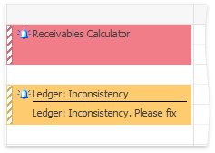
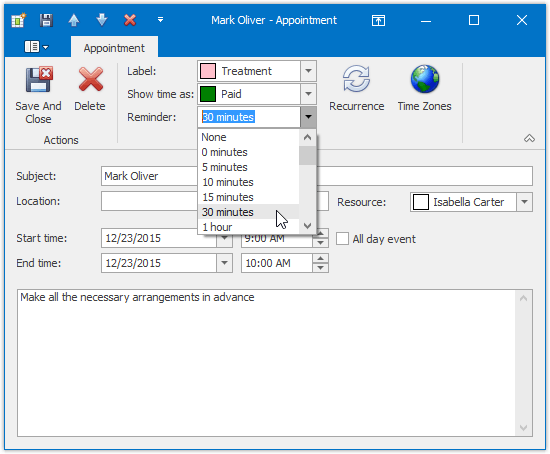
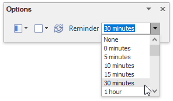

# Manage Reminders
## What is a Reminder?
An appointment can have one or more reminders. They are responsible for sending alerts at specified time periods before an appointment's start time. If an appointment has a reminder, the bell  image is displayed.

## Specifying Reminders
A reminder can be created for a particular appointment with the help of the appointment's editing form, demonstrated below. Select the **Reminder** check box and enter the amount of time before the appointment when you want the reminder to occur.  You can select a predefined value in a drop-down list, or just type it in. The duration editor recognizes digits as the number of minutes if an "h" postfix is added - as hours, "d" - days.

If a scheduler is provided with the [Bar](../scheduler-ui/toolbars.md) or [Ribbon](../scheduler-ui/ribbon-interface.md) interface, you can specify reminders by selecting the required value from the **Reminder** drop-down list on the **Options** toolbar or Ribbon page group, which is active when an appointment is selected.

| Delete an appointment via Bar interface | Delete an appointment via Ribbon interface |
|---|---|
|  |  |

## How Does It Work?
When the time has come for the reminder alert, it invokes the notification dialog, as illustrated below.

You can switch the reminders off by clicking the **Dismiss** or **Dismiss All** buttons.

Another option is to shift the alert time by selecting the time interval in the combo box and clicking the **Snooze** button. Then, the notification will be postponed for a specified time frame.