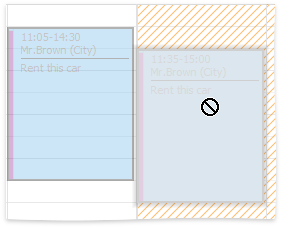

# Restrictions for Operations with Appointments
Access to several operations may be restricted. You may find that you're not able to perform the following operations due to restrictions applied by your application vendor or administrator.
* Create new appointments.
* Edit appointments.
* Invoke the appointment editing form.
* Activate an in-place editor for an appointment.
* Change the time boundaries of appointments.
* Drag and drop appointments to another time slot or date.
* Drag and drop appointments between resources.
* Copy appointments.
* Delete appointments.
* Select more than one appointment simultaneously.
* Share the scheduled time between two or more appointments.
	
	When you drag an appointment to relocate it, it may conflict with another. This situation is visually indicated as illustrated below:
	
	