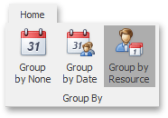

# Scheduler Grouping
The appointment data displayed within the scheduler can be grouped either by resources or by dates to enhance visual representation. The following pictures illustrate the appearance of the scheduler in different grouping modes.

| Appointments are grouped by resources | Appointments are grouped by dates |
|---|---|
|  |  |

If a scheduler is provided with the Bar or Ribbon interface, you can specify the type of grouping appointments using the **Group By** [toolbar](../scheduler-ui/toolbars.md) or [Ribbon page group](../scheduler-ui/ribbon-interface.md).

| Group appointments via Bar interface | Group appointments via Ribbon interface |
|---|---|
|  |  |

See also the [Navigate Scheduler Resources](../selection-and-navigation/navigate-scheduler-resources.md) topic.