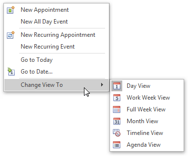
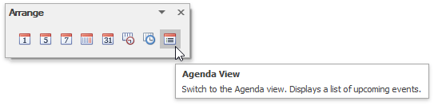
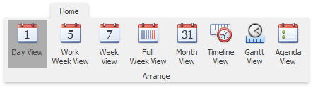
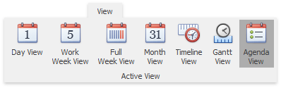

# Switch Scheduler Views
## Change Active View
The scheduler is intended to display appointment data using one of the standard [Views](#viewtypes). The currently active view used by the scheduler can be either selected intentionally or changed according to the scheduler's internal logic.
* To change the active view, use the corresponding item of the scheduler's context menu. This menu is invoked when you right-click any region of the scheduler (not occupied with an appointment).
	
	
	
	> [!NOTE]
	> Depending on the application vendor, some options may be unavailable in your application.
* While navigating through dates via the **Go To Date** dialog, you can specify a view type to display a new time interval.
	
	
* The scheduler selects a view mode automatically, according to the date range selected in the date navigator, combined with a scheduler.
* If a scheduler is provided with the Bar or Ribbon interface, you can use the **Active View** and **Arrange** [toolbar](../scheduler-ui/toolbars.md)s or [Ribbon page group](../scheduler-ui/ribbon-interface.md)s.
	
	| Change the active view via Bar interface | Change the active view via Ribbon interface |
	|---|---|
	|  |  |
	|  |  |

## <a name="viewtypes"/>Available View Types
* **Day View** 
	
	This view provides the most detailed view of appointments for a certain day(s).
* **Work-Week View**
	
	 This view displays appointments for the working days in a particular week.
* **Week View**
	
	 This view displays appointments for any given week.
* **Month (also called Multi-Week) View** 
	
	 The month view is the least detailed of the views, and is designed to allow browsing and long-term plan analysis. This view positions the days one after another horizontally, so that they form weeks, while weeks are placed one under the other.
* **Timeline View**
	
	 This view plots appointments as horizontal bars along the timescales, and provides a clearer overview for scheduling purposes.
* **Gantt View**
	
	 This view displays appointments as horizontal bars along the timescales, shows the current schedule status using percent-complete shadings and displays dependency relationships between appointments.
* **Agenda View**
	
	 This view displays appointment as a chronological list grouped by day.