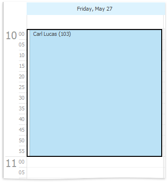
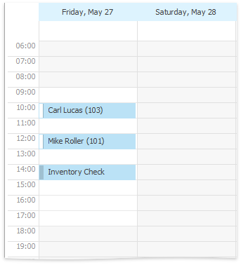
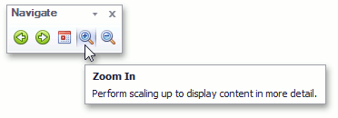
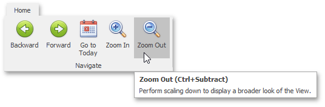

# Zoom the Scheduling Area
You can zoom in the scheduler view to display its content in greater detail, or zoom out for a more general view. Zooming is implemented by adjusting the time scales (in the Day, Work-Week or Timeline [views](switch-scheduler-views.md)) or changing the number of visible weeks (in the Month view).

| Zooming in | Zooming out |
|---|---|
|  |  |

Zooming operations are available for you via the **CTRL+PLUS SIGN**, **CTRL+MINUS SIGN** or **CTRL+MOUSE WHEEL** key combinations.

If a scheduler is provided with the Bar or Ribbon interface, you can zoom in and zoom out the scheduler area using the corresponding buttons on the **Navigate** [toolbar](../scheduler-ui/toolbars.md) or [Ribbon page group](../scheduler-ui/ribbon-interface.md).

| Zoom scheduler via Bar interface | Zoom scheduler via Ribbon interface |
|---|---|
|  |  |