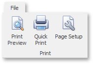
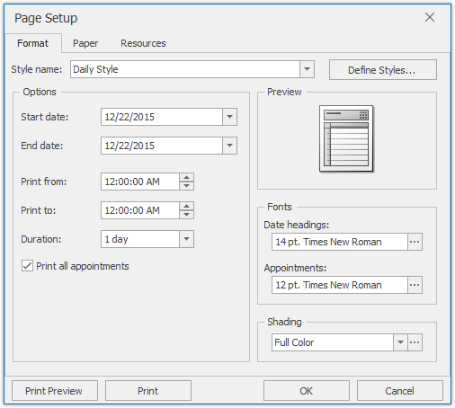
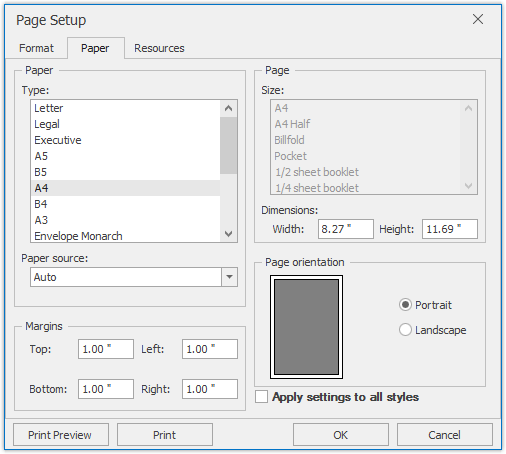
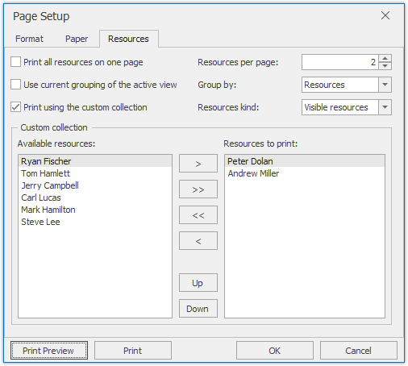

# Printing
If a scheduler includes a Bar or Ribbon interface, you can use the **Print** [toolbar](scheduler-ui/toolbars.md) or [Ribbon page group](scheduler-ui/ribbon-interface.md).

| Print via the Bar interface | Print via the Ribbon interface |
|---|---|
|  |  |

## Page Setup
Click the **Page Setup** command button to invoke the **Page Setup** dialog. The **Page Setup** dialog consists of the **Format**, **Paper** and **Resources** tab pages, as illustrated in the images below.

## Print Preview
Click the **Print Preview** button to invoke the **Print Preview** dialog, which provides a preview of the page to be printed.

This dialog allows you to print the page, or save it to a file as a PDF or an image (e.g., BMP, EMF, WMF, GIF, JPEG, PNG or TIFF).

## Print
Click the **Quick Print** command button to send the scheduler content to the default printer using the current page and printer settings.