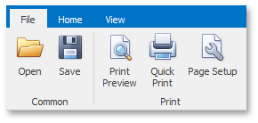
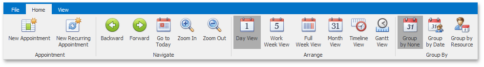
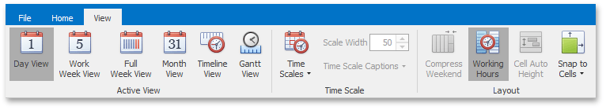
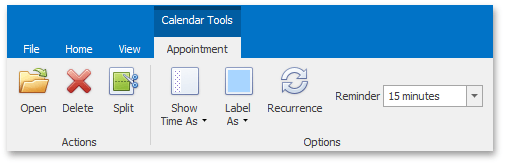

# Ribbon Interface
A scheduler can be accompanied by a set of of Ribbon tabbed pages that provide you with a comprehensive functionality to perform basic operations in a scheduler ([navigate through dates](../selection-and-navigation/navigate-dates-in-the-scheduler.md), [change active view](../layout-customization/switch-scheduler-views.md), [create](../appointment-management/create-appointments.md), [edit](../appointment-management/edit-appointments.md) and [delete appointments](../appointment-management/delete-appointments.md), [select a type for grouping scheduler data](../layout-customization/scheduler-grouping.md), etc.) via a Ribbon interface. Ribbon pages are structurally and visually split into logical groups. Each of these groups includes commands that have certain common features.

## File

* Import and export data in the iCalendar format.
* [Print scheduler data](../printing.md)

## Home

* [Create Appointments](../appointment-management/create-appointments.md)
* [Navigate Dates in the Scheduler](../selection-and-navigation/navigate-dates-in-the-scheduler.md)
* [Switch Scheduler Views](../layout-customization/switch-scheduler-views.md)
* [Scheduler Grouping](../layout-customization/scheduler-grouping.md)

## View

* [Switch Scheduler Views](../layout-customization/switch-scheduler-views.md)
* Customize the active view layout.

## Appointment

* [Edit Appointments](../appointment-management/edit-appointments.md)
* [Manage Reminders](../appointment-management/manage-reminders.md)