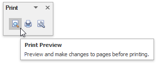
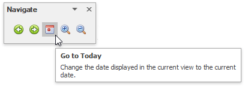
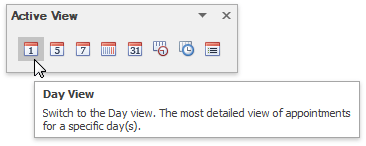

A scheduler can be accompanied by a set of toolbars that provide you with a comprehensive functionality to perform basic operations in a scheduler ([navigate through dates](../../../../interface-elements-for-desktop/articles/scheduler/selection-and-navigation/navigate-dates-in-the-scheduler.md), [change active view](../../../../interface-elements-for-desktop/articles/scheduler/layout-customization/switch-scheduler-views.md), [create](../../../../interface-elements-for-desktop/articles/scheduler/appointment-management/create-appointments.md), [edit](../../../../interface-elements-for-desktop/articles/scheduler/appointment-management/edit-appointments.md) and [delete appointments](../../../../interface-elements-for-desktop/articles/scheduler/appointment-management/delete-appointments.md), [select a type for grouping scheduler data](../../../../interface-elements-for-desktop/articles/scheduler/layout-customization/scheduler-grouping.md), etc.) via a Bar interface.

## Common

* Import and export data in the iCalendar format.

## Print

* [Print scheduler data](../../../../interface-elements-for-desktop/articles/scheduler/printing.md)

## Appointment

* [Create Appointments](../../../../interface-elements-for-desktop/articles/scheduler/appointment-management/create-appointments.md)

## Navigate

* [Navigate Dates in the Scheduler](../../../../interface-elements-for-desktop/articles/scheduler/selection-and-navigation/navigate-dates-in-the-scheduler.md)
* [Zoom the Scheduling Area](../../../../interface-elements-for-desktop/articles/scheduler/layout-customization/zoom-the-scheduling-area.md)

## Arrange

* [Switch Scheduler Views](../../../../interface-elements-for-desktop/articles/scheduler/layout-customization/switch-scheduler-views.md)

## Group By

* [Scheduler Grouping](../../../../interface-elements-for-desktop/articles/scheduler/layout-customization/scheduler-grouping.md)

## Active View

* [Switch Scheduler Views](../../../../interface-elements-for-desktop/articles/scheduler/layout-customization/switch-scheduler-views.md)

## Time Scale

* Specify time scales.

## Layout

* Customize the active view layout.

## Actions

* [Edit Appointments](../../../../interface-elements-for-desktop/articles/scheduler/appointment-management/edit-appointments.md)
* [Delete Appointments](../../../../interface-elements-for-desktop/articles/scheduler/appointment-management/delete-appointments.md)

## Options

* [Edit Appointments](../../../../interface-elements-for-desktop/articles/scheduler/appointment-management/edit-appointments.md)
* [Manage Reminders](../../../../interface-elements-for-desktop/articles/scheduler/appointment-management/manage-reminders.md)