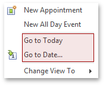
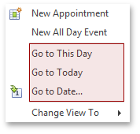
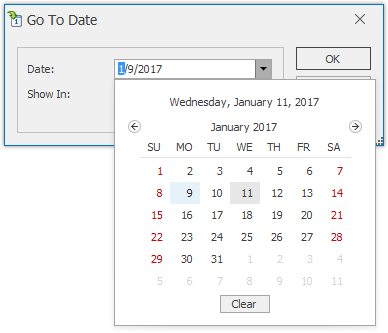
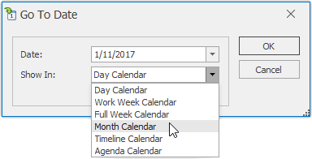
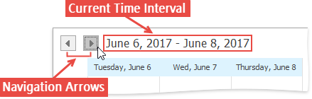
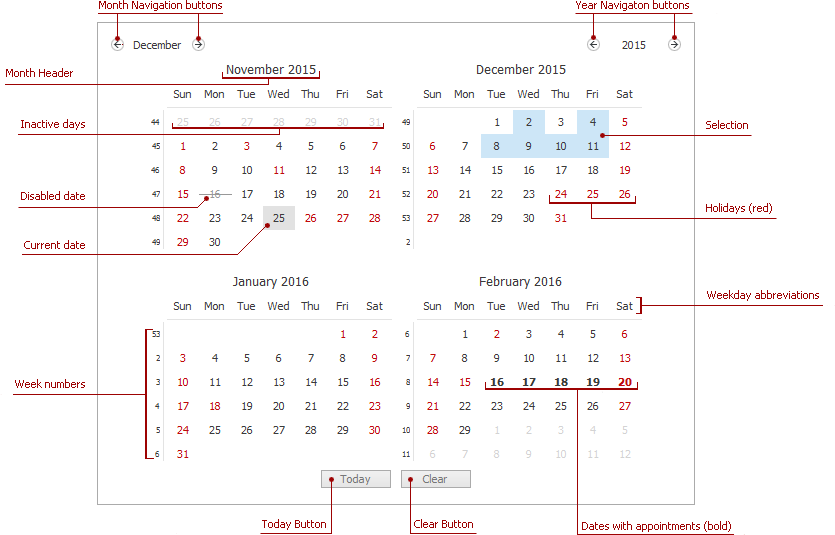

# Navigate Dates in the Scheduler
## Context Menu
Right-clicking within the main area of the scheduler opens the context menu, which contains items for navigating through dates.

| View | Month View |
|---|---|
|  |  |
* **Go to This Day**
	
	Only available in the **Month View**. This item is active when only one day is selected, and when activated, displays the target day in the **Day View** mode.
* **Go to Today**
	
	Moves focus to the current date, preserving the existing view mode.
* **Go to Date...**
	
	Invokes the **Go To Date** dialog to select the date and view type. The date can be selected either by using the calendar or by entering a string with the placeholders. To select the desired view type, use the **Show In** drop-down box.
	
	
	
	

## Date Navigation Bar
You can navigate through dates using **Date Navigation Bar**. Clicking its navigation arrows moves backward and forward by the time frame. The current time interval is indicated near the arrows.

## Date Navigator
If the scheduler is accompanied by the **date navigator**, you can use it to navigate through dates. The common look of the date navigator is illustrated in the following picture.

You can select either a particular date, or a range of dates in the date navigator, and the scheduler will display your selection using a **Day View**. The table below details how you can select dates in different ways.

| Action | Effect |
|---|---|
| Click a date | A single date is selected and the scheduler displays it using the **Day View**. If the currently active view is of another type, it is automatically changed to **Day View**. |
| Click and drag across multiple dates, or click a start date, hold down the SHIFT key and click an end date | The continuous range of dates is selected. The scheduler displays it using the **Day View**, irrespective of the size of the selected range. |
| Hold down the CTRL key and click several dates | A set of dates is selected. The scheduler displays it using the **Day View**, irrespective of the size of the selected range. |
| Click a week number | A corresponding week-long range is selected. The scheduler displays it using the **Day View**. |

## Bar or Ribbon Interface
If a scheduler is provided with the Bar or Ribbon interface, you can navigate through dates within a scheduler using the **Backward**, **Forward** and **Go to Today** buttons of the **Navigate** [toolbar](../scheduler-ui/toolbars.md) or [Ribbon page group](../scheduler-ui/ribbon-interface.md).

| Navigate through dates via Bar interface | Navigate through dates via Ribbon interface |
|---|---|
|  |  |