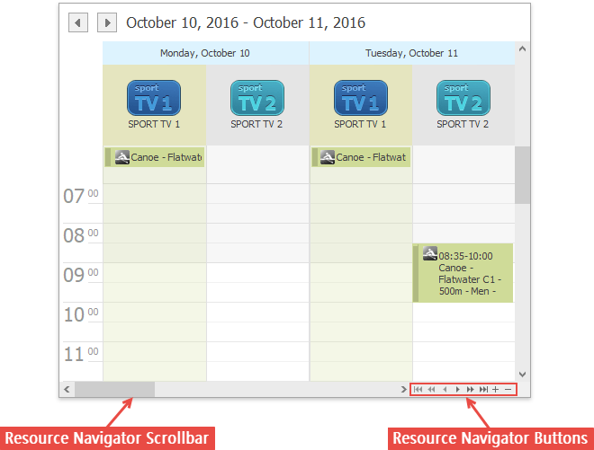

# Navigate Scheduler Resources
When appointment data is grouped (either by resources or by dates), the number of resources shown on the screen within the Scheduler at once can make it difficult to see all the scheduled data. To make the Scheduler's layout more readable, it is possible to limit the number of visible resources, and then scroll between them. There is an embedded **Resource Navigator** control, which allows you to scroll between resources.

The **Resource Navigator** control is composed of a scrollbar and a set of buttons. It may be shown horizontally (on the bottom line of the Scheduler control, with buttons in the right corner) or vertically (on the right side, buttons at the bottom). The position of the control is chosen automatically. It is vertical in **Day** and **Week** views, if appointments are grouped by dates, and horizontal in other view modes.

The mode of operation is rather straightforward - you can click the buttons to move back and forth through the list of resources; one by one, or straight to the first or last one on the list. The buttons with plus and minus signs increase or decrease the number of displayed resources by one.

