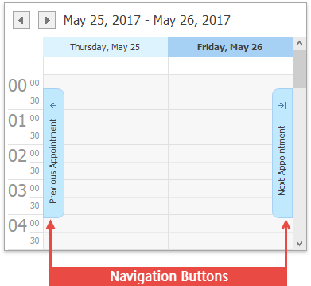

# Scheduler Navigation Buttons
The **Navigation Buttons** are used to scroll to the previous or next appointment. This is helpful when there is a significant time interval between scheduled appointments.

Navigation buttons are displayed if there are no currently visible appointments within the **Scheduler** control area. If there are appointments that refer to a previous or successive date, the **Previous Appointment** and **Next Appointment** navigation buttons  provide the capability to navigate to the corresponding date. If there are no appointments in a specific direction, the corresponding navigation button is disabled.

Note that if the **Scheduler** control currently displays appointments for multiple resources, navigation buttons are displayed independently for each resource.