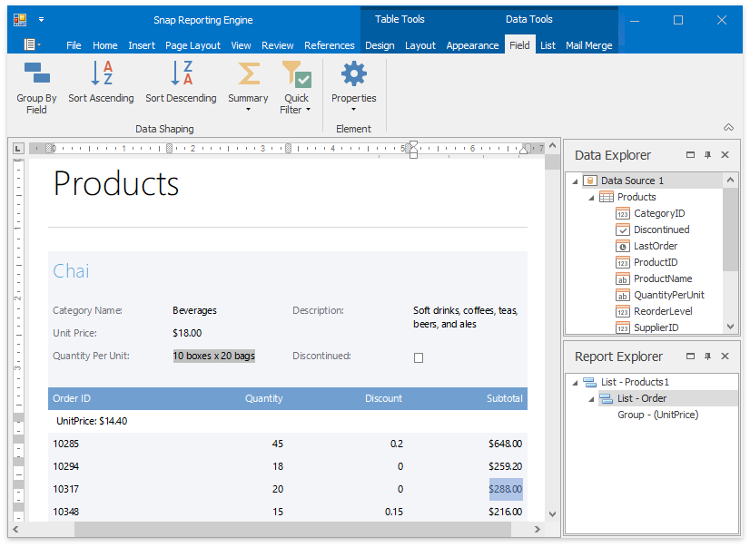

# Snap Reporting Engine
This guide provides information on the basic principles of creating reports with Snap.

Snap is a WYSIWYG reporting engine that provides a user interface that allows for a quick creation of standard reports with the capabilities of data shaping (grouping, sorting and filtering), hierarchical data representation (master-detail reports), mail merge and much more.

The following sections are available in this guide.
* [Graphical User Interface](snap-reporting-engine/graphical-user-interface.md)
* [Connect to Data](snap-reporting-engine/connect-to-data.md)
* [Create a Report Layout](snap-reporting-engine/create-a-report-layout.md)
* [Manage Documents and Files](snap-reporting-engine/manage-documents-and-files.md)