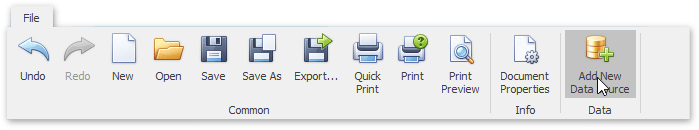
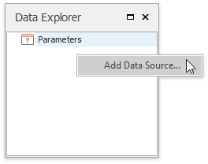
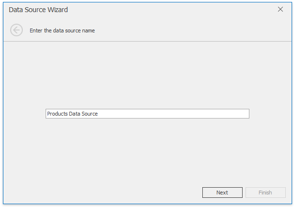
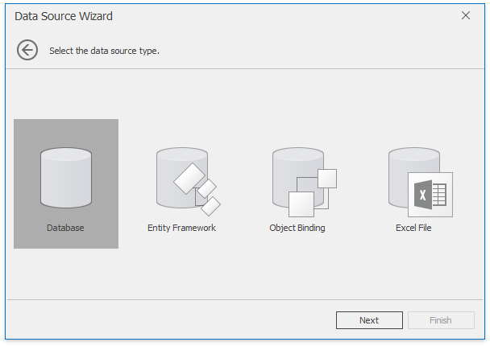
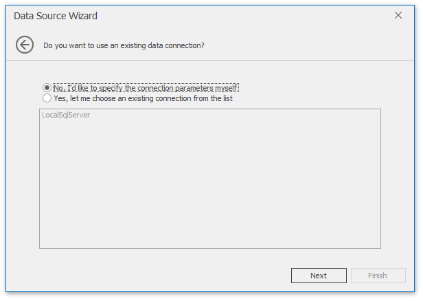
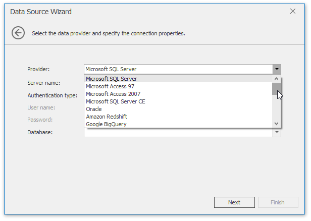
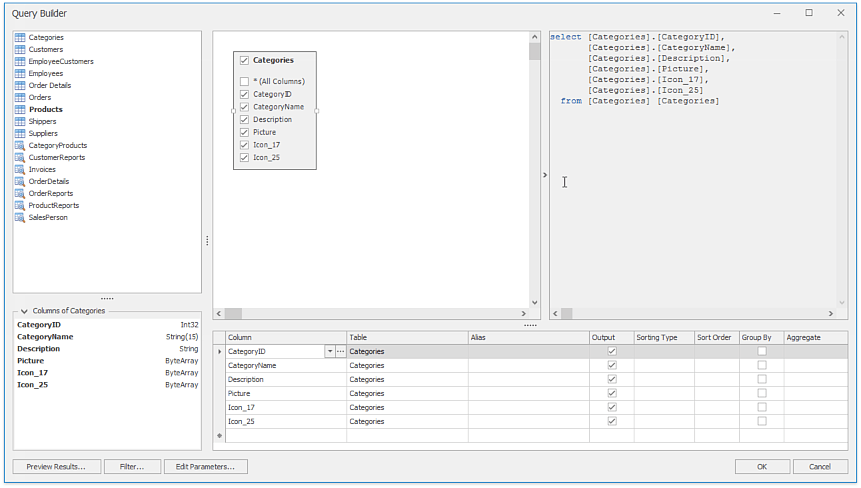
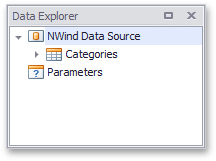
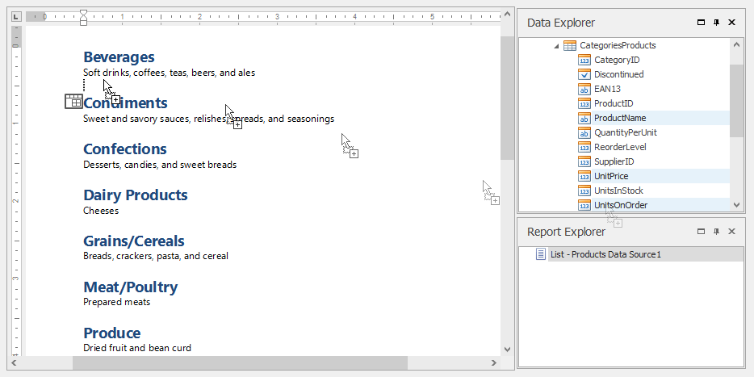

# Connect a Document to a Data Source
This tutorial describes the steps required to connect a Snap document to data by using the **Data Source Wizard** and [Query Builder](use-the-query-builder.md).
1. Click **Data** | **Add New Data Source** on the Snap application's ribbon toolbar.
	
	
	
	Alternatively, right-click anywhere in the [Data Explorer](../graphical-user-interface/snap-application-elements/data-explorer.md) and click **Add Data Source** in the invoked menu.
	
	
	
	The **Data Source Wizard** is invoked. Proceed with the following steps in the wizard.
	1. On the first page of the invoked **Data Source** wizard, specify a name for the new data source and click **Next**.
		
		
	2. On the next page, select a data source type (Database) and click **Next**.
		
		
	3. If a data connection has already been specified in the application, the next wizard page allows you to select whether to use one of the existing connections, or create a new one.
		
		
	4. On the next page, select a data provider, specify the required connection settings and click **Next**.
		
		
		
		On this page, you can define a custom connection string, or select from the following supported data source types.
		* Microsoft SQL Server
		* Microsoft Access 97
		* Microsoft Access 2007
		* Microsoft SQL Server CE
		* Oracle
		* Amazon Redshift
		* Google BigQuery
		* Teradata
		* Firebird
		* IBM DB2
		* Firebird
		* IBM DB2
		* MySQL
		* Pervasive PSQL
		* PostgreSQL
		* SAP Sybase Advantage
		* SAP Sybase ASE
		* SQLite
		* VistaDB
		* VistaDB5
		* XML File
		
		Depending on the selected data provider, it may be necessary to specify additional connection options (such as authentication type and database name) on this page.
		
		To proceed to the next wizard page, click **Next**.
	5. On the next page you are prompted to save the connection string including or excluding the user name and a password. Choose any option and click **Next**.
	6. This page allows you to select a query or a stored procedure.
		
		Click **Run Query Builder...** to invoke the [Query Builder](use-the-query-builder.md) window.
		
		
	7. In the invoked **Query Builder** window, double-click the **Categories** item in the list of available tables on the left to add it to the tables included into the query.
		
		Enable the check box for the **Categories** table, to include all of its fields in the view.
		
		
		
		Click **OK** to close the Query Builder and return to the Data Source Wizard.
	8. When the query is ready, click **Finish** to save it.
		
		
2. After the data source has been added to the report, the hierarchy of its data members is reflected in the [Data Explorer](../graphical-user-interface/snap-application-elements/data-explorer.md).
	
	

The Snap report is now connected to data. Drag-and-drop the **CategoryName** and **Description** data fields from the Data Explorer onto the document's body to create a simple data-aware report.

