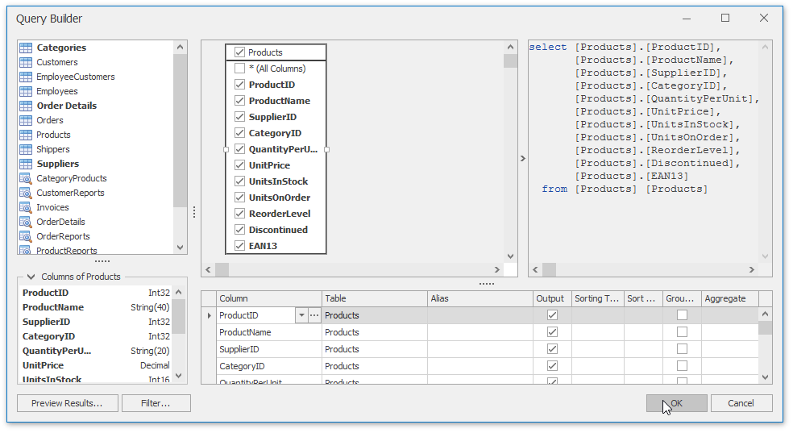
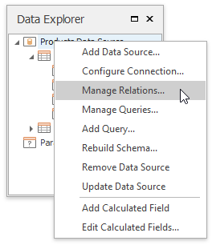
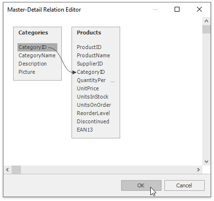
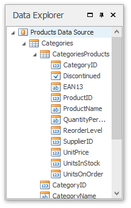

# Create a Master-Detail Data Source
This tutorial describes how to add a master-detail relation to the document's data source.

Prior to the following steps, connect a Snap document to data as shown in the [Connect a Document to a Data Source](connect-a-document-to-a-data-source.md) tutorial.
1. Right-click the **NWind Data Source** node in the **Data Explorer** window and select **Manage Queries...** in the invoked context menu.
	
	
2. The **Manage Queries** dialog is displayed. It lists the available queries and allows you to edit them, delete or add a new query. Click  the ellipsis to the right of the query name to invoke the **Query Editor** dialog for the selected query.
	
	
3. Click **Run Query Builder..** to invoke the Query Builder window.
	
	
4. Double-click the **Products** item in the list of available tables on the left to include it in the list of data tables to be used.
	
	
	
	Enable the check box for the **Products** table, to include all of its fields in the view.
	
	Click **OK** to close the Query Builder. Click **Finish** to close the **Query Editor**. Click **OK** to close the Manage Queries window which contains now two queries.
5. Right-click the **NWind Data Source** node in the **Data Explorer** window and select **Manage Relations...** in the invoked context menu.
	
	
6. In the invoked **Master-Detail Relation Editor** window select the CategoryID item in the Categories table and drag it to item of the same name in the Products table.
	
	
7. The relation is created as illustrated in the following image.
	
	
	
	Next, click **OK** to apply changes to the data source and exit.
8. The content of the **Data Explorer** will be updated to reflect the new structure of the document data source.
	
	