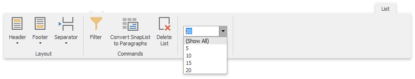
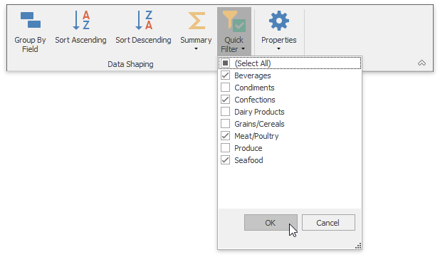
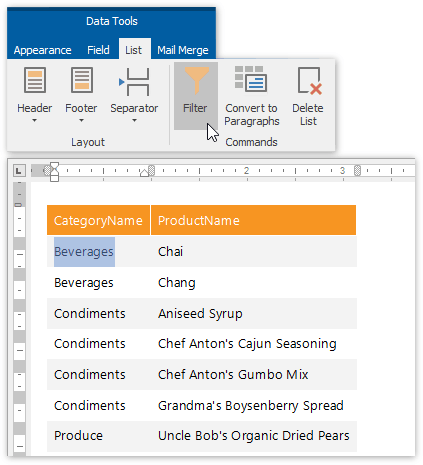
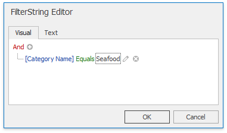
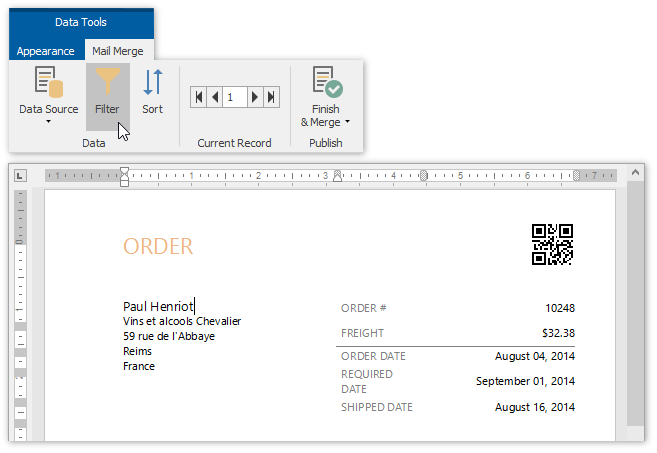
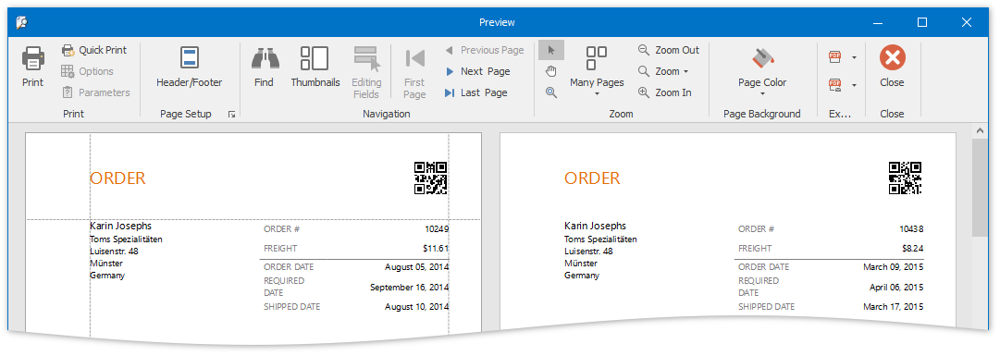

# Filter Data
This document describes how to filter dynamic data within a **Snap** document.

The document consists of the following sections.
* [Filter Data on the Design Surface](#filterdataindesignsurface)
* [Filter Data at the Data Source Level](#filterdataatthedatasourcelevel)
* [Filter Snap List Data](#filtersnaplistdata)
* [Filter Mail Merge Document Data](#filtermailmergedocumentdata)

## <a name="filterdataindesignsurface"/>Filter Data on the Design Surface
To improve performance, the Snap [Design Surface](../graphical-user-interface/snap-application-elements/design-surface.md) displays only the first **20** data rows while the document layout is being designed. To change the number of data rows displayed, specify the **Editor Row Limit** option, which is located in the **List** tab of the main toolbar.

This setting does not affect the final document.

## <a name="filterdataatthedatasourcelevel"/>Filter Data at the Data Source Level
Filtering data at the data source level is useful when dealing with large data sources because it reduces data retrieval time, and thus speeds up document generation.

To filter data at the data source level, use the [Query Builder](use-the-query-builder.md).

## <a name="filtersnaplistdata"/>Filter Snap List Data
To select which data records to include in the document, click the **Quick Filter** command in the **Field** tab of the contextual **Data Tools** toolbar category. In the invoked drop-down menu, select the required records and click **OK** to apply the filtering.

To specify the filtering criteria for **Snap list** data, do the following.
1. Place the text cursor inside the Snap list that you wish to filter and click the **Filter** command in the **List** tab of the contextual **Data Tools** toolbar category.
	
	
2. In the invoked **FilterString Editor**, construct the required filter expression and click **OK** to apply the filtering.
	
	

## <a name="filtermailmergedocumentdata"/>Filter Mail Merge Document Data
Filtering a **mail merge document** defines which data entries will appear as pages of the final document.

To filter a mail merge document, do the following.
1. Switch to the **Mail Merge** tab of the contextual **Data Tools** toolbar category, and click the **Filter** command.
	
	
2. In the invoked **FilterString Editor**, construct the required expression and click **OK** to apply the filtering.
	
	
3. To view the result, click the **Finish &amp; Merge** button in the **Mail Merge** tab of the contextual **Data Tools** toolbar category, and select **Print Preview...** in the drop-down menu. In the invoked **Export Range** dialog, select **All records** and click **OK**.
	
	
	
	The following image illustrates a print preview for a filtered mail merge document.
	
	