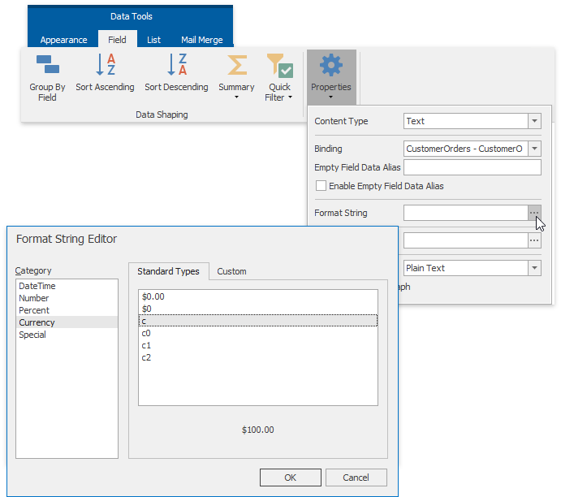

# Format Data
This document describes how to format dynamic textual data in a **Snap** document.

To format report data, do the following.
1. Select the **Snap field** that you wish to format. It must be a field displaying textual information (e.g., a **Text** field or a **Row Index** field). This will activate the **Field** tab in the contextual **Data Tools** toolbar category.
2. In the **Field** tab, click the **Properties** button.
3. In the invoked drop-down menu, click the ellipsis button for the **Format String** property.
4. Specify the required  formatting in the invoked **FormatString Editor**, and click **OK** to exit the dialog.
	
	

Snap supports both [standard](http://msdn.microsoft.com/en-us/library/ee372286.aspx) and [custom](http://msdn.microsoft.com/en-us/library/ee372287.aspx) .NET format strings.