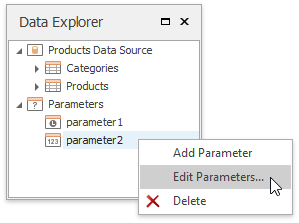
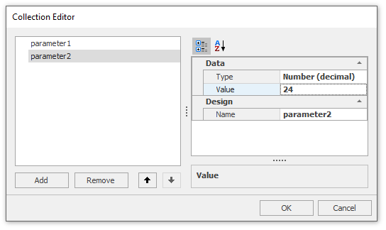
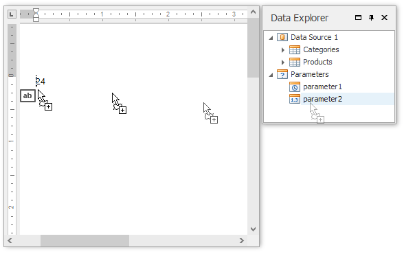
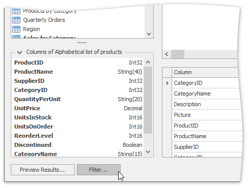
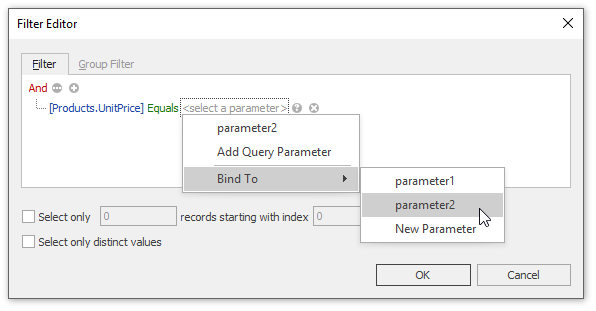
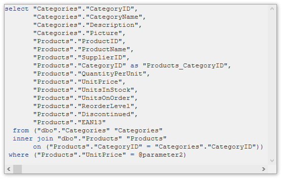
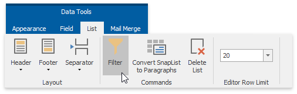
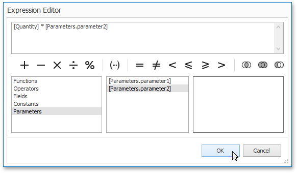

# Pass Parameter Values
This document describes the main concepts for using parameters in **Snap**, and provides examples of their use in various tasks.

The document consists of the following sections.
* [Create Parameters](#createparameters)
* [Pass Parameter Values](#passvalues)

## <a name="createparameters"/>Create Parameters
You can manage the report parameters available for a Snap document using the **Parameters** dialog.

To invoke the **Parameters** dialog, right-click the **Parameters** node (or any of its sub-nodes) in the [Data Explorer](../graphical-user-interface/snap-application-elements/data-explorer.md) and select **Edit Parameters...** in the invoked drop-down menu.

The **Parameters** dialog allows you to add and remove parameters using the corresponding buttons. Alternatively, you can add or remove a parameter by right-clicking the parameter in the **Data Explorer** and selecting the required action in the invoked drop-down menu.

Select the newly added parameter and specify its properties in the properties grid. Be sure to specify the proper parameter type based on the parameter's intended use.

## <a name="passvalues"/>Pass Parameter Values
After a parameter is created, it can be used in different ways during report generation. Below is a list of tasks that can be accomplished using parameters.
* **Data Binding**
	
	To display a parameter's value in a report, drag the parameter from the Field List and drop it onto the [Design Surface](../graphical-user-interface/snap-application-elements/design-surface.md).
	
	
* **Filtering**
	
	You can use a report parameter as part of a filtering expression to [filter the Snap document data](filter-data.md) at either the report level or the data source level.
	
	To filter the Snap document data at the data source level, do the following.
	1. Invoke the **Query Builder** for the data source that you wish to filter.
	2. In the **Query Builder**, click the **Filter** button to invoke the **Filter Editor**.
		
		
	3. In the **Filter Editor**, construct an expression where the parameter's value is used as a filtering criterion. To access the parameter, click the icon on the right. It will turn into a question mark.
		
		
		
		Click **OK** to exit the dialog.
		
		The **SQL** query generated by the query designer will be updated to reflect the specified filtering.
		
		
	
	In a similar way, you can use the **Filter Editor** to filter the Snap document data at the report level. In this case, to invoke the **Filter Editor**, click the **Filter** button that resides on the [List](../graphical-user-interface/main-toolbar/data-tools-list.md) tab of the contextual **Data Tools** toolbar category.
	
	
* **Calculated Fields**
	
	In addition to standard data fields, parameters can be used in expressions for [calculated fields](use-calculated-fields.md). The only difference is that the data field is inserted into the expression's text using its name in [square brackets], while a parameter is inserted using the "**Parameters.**" prefix before its name.
	
	