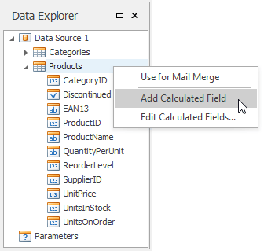
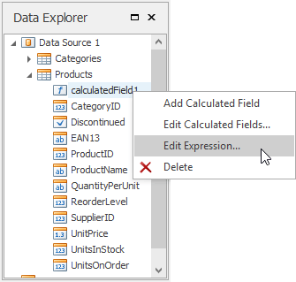

# Use Calculated Fields
This document describes how to use **calculated fields** to evaluate custom expressions based on external data, and embed the results into a Snap document.

Use calculated fields to perform additional calculations on dynamic data and embed the results into a published document.

To create a calculated field and access its collection, invoke the context menu in the [Data Explorer](../graphical-user-interface/snap-application-elements/data-explorer.md).

A calculated field's expression can include conditional, date-time, mathematical and other formulas. It can also evaluate the values of other calculated fields, data source fields and [parameters](pass-parameter-values.md).

The **Expression Editor** is invoked by right-clicking a calculated field and choosing the **Edit Expression…** item in the invoked popup menu.

After a calculated field is inserted into a document, its value is evaluated each time the document is set to be published.