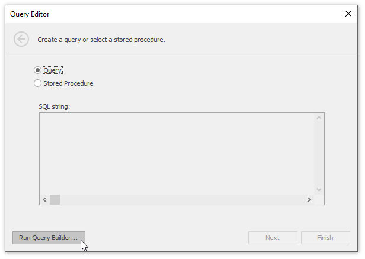
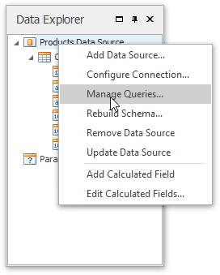
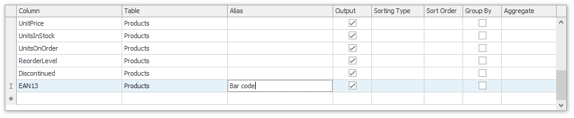

# Use the Query Builder
This topic describes how to use the **Query Builder** to manage data tables and their relations in a Snap data model (e.g., to create master-detail data sources), filter incoming data and specify a custom SQL string.

The Query Builder displays the structure of a connected data source along with its associated Snap data model. When designing a report, this data model is reflected in the [Data Explorer](../graphical-user-interface/snap-application-elements/data-explorer.md).

This topic includes the following sections.
* [Run the Query Builder](#run)
* [Manage Data Tables and their Relations](#manage)
* [Shape Data](#shape)

## <a name="run"/>Run the Query Builder
An option to invoke the Query Builder is provided on the last page of the **Data Source Wizard**. The Data Source Wizard is invoked at [connecting a Snap document to a Data Source](connect-a-document-to-a-data-source.md). Click the **Run Query Builder...** button to invoke the Query Builder window.

Alternatively, you can run the Query Builder by right-clicking a data source in the [Data Explorer](../graphical-user-interface/snap-application-elements/data-explorer.md) and selecting the **Manage Queries...** item in the invoked menu.

## <a name="manage"/>Manage Data Tables
Double-click table names in the rightmost column to add them to the query being edited. To include a particular field in the query, enable the corresponding check box.

The Query Builder automatically highlights the tables of an external data source that are related to the tables of a Snap data model by one or more primary keys.

When the related table is added to the query being edited, the corresponding primary keys are automatically connected.

## <a name="shape"/>Shape Data
To assign a custom name to the selected data column, specify its **Alias** in the column list displayed in the lower part of the window.

To specify the filter criteria applied to source data, click the **Filter** button, which invokes the **Filter Editor**.

