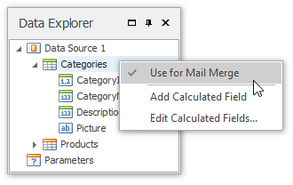
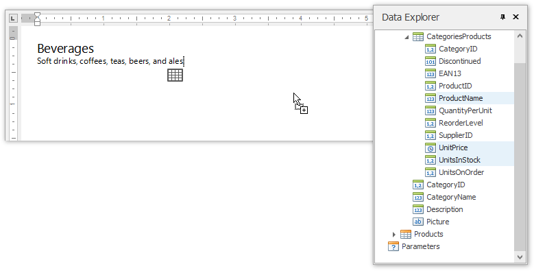
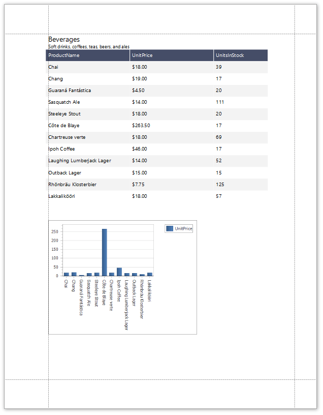

# Create a Combined Report Layout
Snap allows you to create a single combined report, incorporating features of different report layout types. There is no limits on how many reports you can combine.

In this tutorial, we will create a combined report that uses the features of mail-merge and chart-based reports.

The tutorial consists of the following sections.
* [Add Mail-Merge Report Functionality](#mailmerge)
* [Add Chart-Based Report Functionality](#chart)
* [View the Result](#result)

## <a name="mailmerge"/>Add Mail-Merge Report Functionality
In this section, we will create a simple **Mail-Merge Report**.
1. Create a new Snap document and [provide it with a master-detail data connection](../../../../interface-elements-for-desktop/articles/snap-reporting-engine/connect-to-data/create-a-master-detail-data-source.md).
2. Specify which data source will be used for mail merge by right-clicking the required data source in the Data Explorer and select **Use For Mail Merge** in the invoked drop-down menu.
	
	
3. Insert a master report part. To do this, drag-and-drop data fields from the [Data Explorer](../../../../interface-elements-for-desktop/articles/snap-reporting-engine/graphical-user-interface/snap-application-elements/data-explorer.md) onto the  [Design Surface](../../../../interface-elements-for-desktop/articles/snap-reporting-engine/graphical-user-interface/snap-application-elements/design-surface.md).
	
	
4. To insert a detail report part, drag-and-drop fields from a subordinate node of the data source.
	
	
	
	The added detail part will have a tabular form by default.
	
	

For more information on the creation mail-merge report, see the tutorial [Create a Mail-Merge Report](../../../../interface-elements-for-desktop/articles/snap-reporting-engine/create-a-report-layout/create-a-mail-merge-report.md).

## <a name="chart"/>Add Chart-Based Report Functionality
In this section we will add a **Chart** to the Snap document.
1. Click the **Chart** command in the [Insert](../../../../interface-elements-for-desktop/articles/snap-reporting-engine/graphical-user-interface/main-toolbar/general-tools-insert.md) tab of the main toolbar.
	
	
2. In the created chart, the blue circles correspond to the values and arguments of the chart. Drop one field from a subordinate node of the data source onto the "values" region in the chart...
	
	
	
	...and the other onto the "arguments" region.
	
	

For more information on the creation of a chart-based report, see the tutorial [Create a Chart-Based Report](../../../../interface-elements-for-desktop/articles/snap-reporting-engine/create-a-report-layout/create-a-chart-based-report.md).

## <a name="result"/>View the Result
* The Snap mail merge document is now ready. To view the result, click the **Finish &amp; Merge** button in the [Mail Merge](../../../../interface-elements-for-desktop/articles/snap-reporting-engine/graphical-user-interface/main-toolbar/data-tools-mail-merge.md) tab, and select **Print Preview...** in the invoked  drop-down menu. In the invoked **Export Range** dialog, select **All records** and click **OK**.
	
	
	
	The following image illustrates a print preview for the final document.
	
	