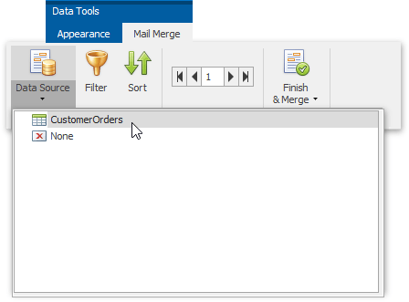
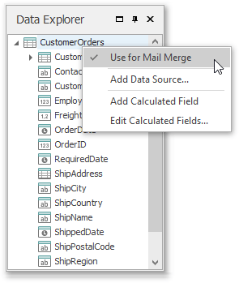
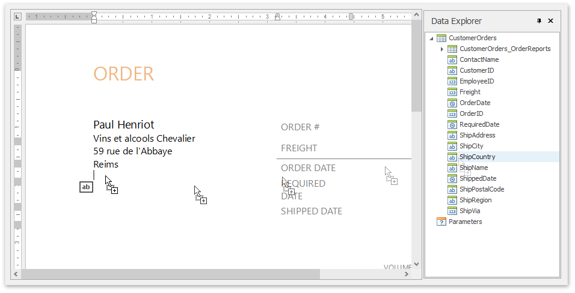
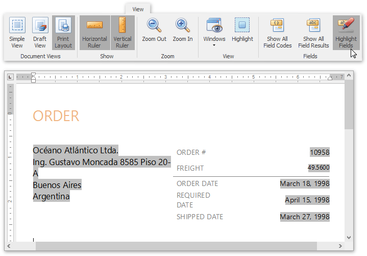
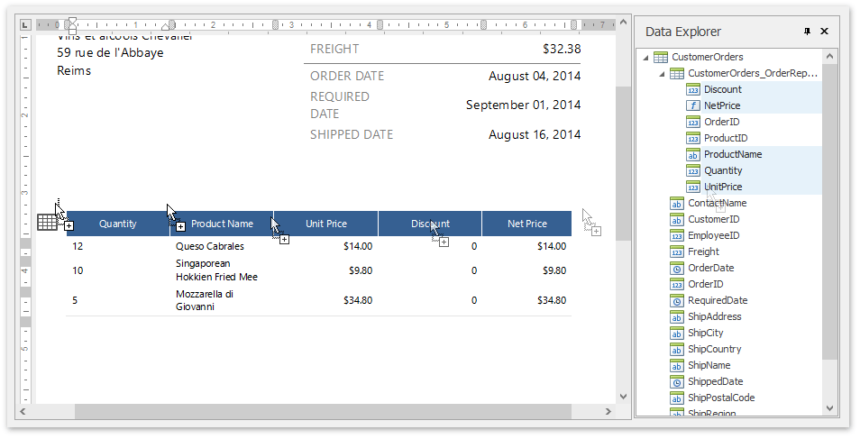

# Create a Mail-Merge Report
This tutorial illustrates the steps required to create and publish a mail merge report with **Snap**.

The tutorial contains following sections.
* [Add Dynamic Content](#adddynamiccontent)
* [Preview and Publish the Document](#result)

## <a name="adddynamiccontent"/>Add Dynamic Content
To create a Snap report using a document template, do the following.
1. Add a new Snap document and [provide it with a master-detail data connection](../connect-to-data/create-a-master-detail-data-source.md).
2. Next, specify which data source will be used for mail merge. To do this, click the **Data Source** button on the [Data Tools: Mail Merge](../graphical-user-interface/main-toolbar/data-tools-mail-merge.md) tab and select the required data source in the invoked drop-down list.
	
	
	
	Alternatively, right-click the required data source in the [Data Explorer](../graphical-user-interface/snap-application-elements/data-explorer.md) and select **Use For Mail Merge** in the invoked drop-down menu.
	
	
3. To insert data bound fields into the document, drag-and-drop data fields from the [Data Explorer](../graphical-user-interface/snap-application-elements/data-explorer.md) onto the  [Design Surface](../graphical-user-interface/snap-application-elements/design-surface.md).
	
	
	
	Activate the **Highlight Fields** option from the [View](../graphical-user-interface/main-toolbar/general-tools-view.md) tab of the main toolbar to highlight all mail merge fields in a document. This allows you to easily distinguish between dynamic and static content.
	
	
4. To insert a detail report section, drag-and-drop fields from a subordinate node of the data source. Fields of a nested level of a mail-merge data source are inserted into a template as columns of a table.
	
	

## <a name="result"/>Preview and Publish the Document
The Snap mail merge document is now ready. To view the result, click the **Finish &amp; Merge** button in the **Mail Merge** tab, and select **Print Preview...** in the invoked  drop-down menu. In the invoked **Export Range** dialog, select **All records** and click **OK**.

The following image illustrates a print preview for the final document.

