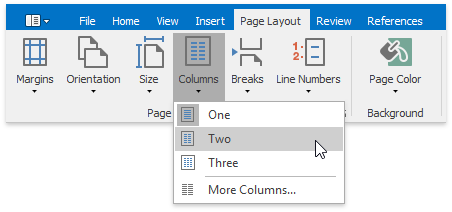
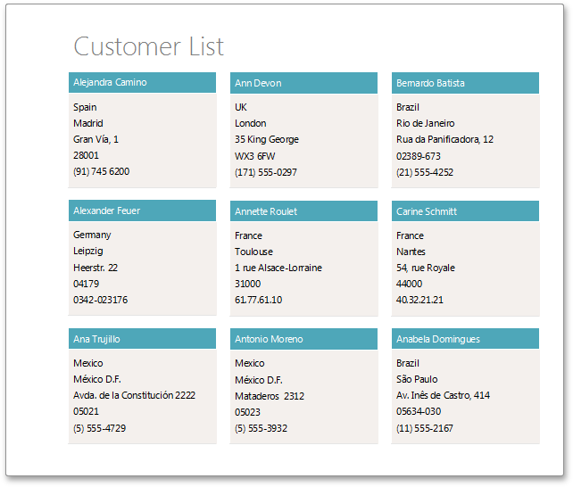

# Create a Multi-Column Report
This tutorial guides you through the creation of a **Multi-Column Report**. A multi-column report is a report which represents its data in multiple columns or rows (depending upon the current multi-column settings).

To create a multi-column report, do the following.
1. In a new Snap document, create a simple table report, as described in the [Create a Table Report](create-a-table-report.md) topic.
2. In the main toolbar, switch to the [General Tools: Page Layout](../graphical-user-interface/main-toolbar/general-tools-page-layout.md) tab, click **Columns**, and select the required number of columns in the drop-down menu.
	
	
	
	To define more than three columns, click **More Columns**. In the invoked **Columns** dialog, customize the report layout to meet your requirements.
	
	

The following image illustrates the result.

