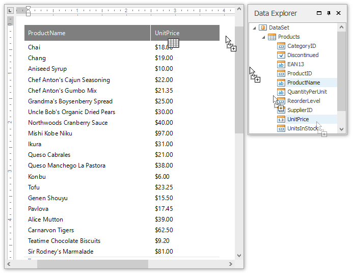
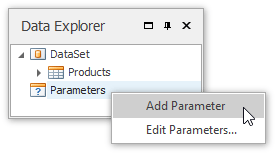
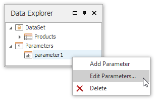
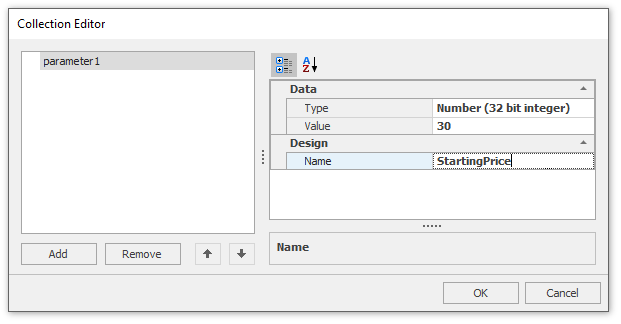
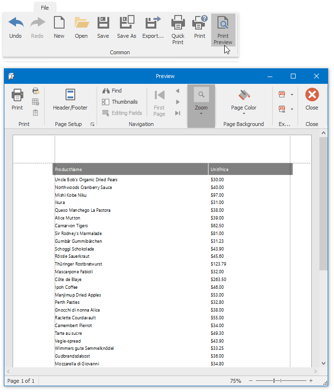

# Create a Parameterized Report
This tutorial illustrates the steps required to create a parameterized report. In this tutorial, we will create a parameter and pass it to the report's filtering expression. You are not limited by the number of parameters you can create, or the data type (e.g., _string_, _date-time_, _Boolean_, _integer_ and _double_). Parameters can be used in other ways such as **data binding** and **calculated fields**. Tasks that can be solved using parameters are described in the [Pass Parameter Values](../connect-to-data/pass-parameter-values.md) topic.

Follow these steps to create a report with parameters.
1. Create a new Snap document and [bind it to the required table](../connect-to-data/connect-a-document-to-a-data-source.md).
2. To create a layout for your report, drop the required data fields from the [Data Explorer](../graphical-user-interface/snap-application-elements/data-explorer.md) to the [Design Surface](../graphical-user-interface/snap-application-elements/design-surface.md).
	
	
3. To create a parameter, switch to the Data Explorer window, right-click the **Parameters** section and choose **Add Parameter**.
	
	
4. Right-click the created parameter and select the **Edit Parameters...** action in the invoked popup menu.
	
	
5. In the invoked editor, define the parameter name and assign an appropriate type to it. This type corresponds to the value that a parameter can receive (e.g., you cannot assign a string value to a numeric parameter).
	
	Next, assign a default static value to the parameter.
	
	
	
	If required, you can easily modify the parameter value in the same way described in steps 4 and 5.
6. Now, switch to the [List](../graphical-user-interface/main-toolbar/data-tools-list.md) tab in the main toolbar and click the **Filter** button.
	
	In the invoked **FilterString** editor, define a filtering expression (e.g., **UnitPrice** data field is greater than or equal to the **Starting Price** parameter).
	
	To access the parameter, click the icon on the right until it turns into a question mark, and then select your parameter from the drop-down list.
	
	

The parameterized report is now ready, and its data is filtered based on the specified expression that uses the parameter value to shape the report's data.

To view how your report will look on paper, switch to the [File](../graphical-user-interface/main-toolbar/general-tools-file.md) tab in the main toolbar and click the **Print Preview** button.

