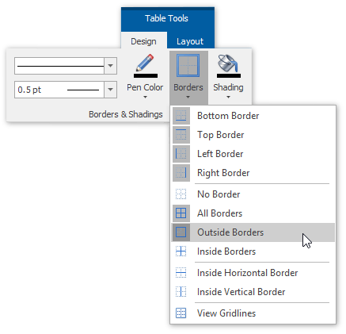

# Create a Side-by-Side Report
This tutorial describes the steps used to create a side-by-side report to compare different items within the report.

Follow these steps to create a side-by-side report.
1. Create a new Snap document and bind it to the required table as described in the [Connect a Document to a Data Source](../../../../interface-elements-for-desktop/articles/snap-reporting-engine/connect-to-data/connect-a-document-to-a-data-source.md) topic.
2. To add a new table to the report, switch to the [Insert](../../../../interface-elements-for-desktop/articles/snap-reporting-engine/graphical-user-interface/main-toolbar/general-tools-insert.md) tab in the main toolbar and click **Table**. Then, move the cursor over the grid to select the required number of rows and columns.
	
	
	
	You can set table borders by clicking the **Borders** button on the [Design](../../../../interface-elements-for-desktop/articles/snap-reporting-engine/graphical-user-interface/main-toolbar/table-tools-design.md) tab.
	
	
3. Then, drop the fields that will be compared from the [Data Explorer](../../../../interface-elements-for-desktop/articles/snap-reporting-engine/graphical-user-interface/snap-application-elements/data-explorer.md) on the table's corresponding columns.
	
	
4. To filter each table column so that it shows only a single record, select a field on the left column and in the activated [Field](../../../../interface-elements-for-desktop/articles/snap-reporting-engine/graphical-user-interface/main-toolbar/data-tools-field.md) tab in the main toolbar, click **Quick Filter**. In the invoked menu, select the required field and click **OK**.
	
	
	
	Finally, repeat the same procedure for the right column, so that it displays a different field to compare it with.
	
	