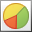

# Chart Tools: Design
This toolbar is context sensitive, and becomes active after selecting a **chart** in the document.

The commands available in the **Design** toolbar of the **Chart Tools** category are divided into the following sections.
* [Chart Type](#charttype)
* [Appearance](#appearance)
* [Wizard](#wizard)

## <a name="charttype"/>Chart Type
| Command | Large&nbsp;Icon | Small&nbsp;Icon | Description |
|---|---|---|---|
| Column |  |  | Changes the type of the selected chart to one of the available column chart types. Column charts are used to compare values across categories. |
| Line |  |  | Changes the type of the selected chart to one of the available line chart types. Line charts are used to display trends over time. |
| Pie |  |  | Changes the type of the selected chart to one of the available pie chart types. Pie charts display the contribution of each value to a total. |
| Bar |  |  | Changes the type of the selected chart to one of the available bar chart types. Bar charts summarize and display categories of data, allowing you to compare the contribution of each value to the total across categories. |
| Area |  |  | Changes the type of the selected chart to one of the available area chart types. Area charts are used to display trends over time. |
| Other&nbsp;Charts |  |  | Changes the type of the selected chart to a point, funnel, financial, radar, polar, range, or Gantt chart. |

## <a name="appearance"/>Appearance
| Command | Large&nbsp;Icon | Small&nbsp;Icon | Description |
|---|---|---|---|
| Palette |  |  | Specifies the **color palette** for the selected chart. |
| Appearance | none | none | Applies a specified [appearance](../../../../../interface-elements-for-desktop/articles/charting/chart-wizard/appearance-page.md) to the selected chart. The collection of style presets available for a chart depends on the chart's **palette**. |

## <a name="wizard"/>Wizard
| Command | Large&nbsp;Icon | Small&nbsp;Icon | Description |
|---|---|---|---|
| Run&nbsp;Chart&nbsp;Wizard... |  |  | Invokes the [Chart wizard](../../../../../interface-elements-for-desktop/articles/charting/chart-wizard.md), which allows you to adjust the main chart settings in a single user interface. |