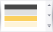

# Data Tools: Appearance
This **Appearance** toolbar contains predefined report styles. After selecting a style, it is applied to all  Snap Lists throughout the document.

The following command is available in the **Report Themes** section of this toolbar.

| Command | Description |
|---|---|
|  | Sets the style to be applied to all Snap lists throughout the document. The style's icon indicates the colors that will be applied to the following report elements (the colors are described from up to down): **1** -  First-level report headers and footers; **2** - First-level group headers and footers; **3** - Second-level report headers and footers; **4** - Second-level group headers and footers. Apart from colors, a visual theme applied to a report may affect the alignment of report elements, their padding and font settings, as well as other appearance properties. A visual theme does not affect elements for which the appearance is defined manually, and only changes their default property values. For example, a theme will not change the background color of a table cell for which the background color has already been specified. Clicking the arrow button invokes the drop-down menu, containing the following commands for managing report theme: **Save the Current Theme to a File...**; **Load a Theme from a File...**; **Restore the Default Document Styles**. |