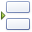

# Data Tools: List
This toolbar is context sensitive, and becomes active after selecting a **Snap list** in the document.

The commands available in the **List** toolbar of the **Data Tools** category are divided into the following sections.
* [Layout](#layout)
* [Commands](#commands)
* [Editor Row Limit](#editorrowlimit)

## <a name="layout"/>Layout
| Command | Large&nbsp;Icon | Small&nbsp;Icon | Description |
|---|---|---|---|
| Header |  |  | Adds or removes the header of a selected Snap list. |
| Footer |  |  | Adds or removes the footer of a selected Snap list. |
| Separator |  |  | Inserts the selected separator between the rows of a Snap list. |

## <a name="commands"/>Commands
| Command | Large&nbsp;Icon | Small&nbsp;Icon | Description |
|---|---|---|---|
| Filter |  |  | Invokes the **FilterString Editor**, which allows you to define complex filtering criteria for a selected Snap list. To select which data records to display for a specific field, use the **Quick Filter** command from the [Data Tools: Field](data-tools-field.md) toolbar. |
| Convert to Paragraphs |  |  | Removes the table layout of a Snap list. The content of the removed table columns is presented as separate paragraphs. There is no reverse action to convert paragraphs back to a tabular representation. |
| Delete List |  |  | Removes the selected list from a document. |

## <a name="editorrowlimit"/>Editor Row Limit
| Command | Large&nbsp;Icon | Small&nbsp;Icon | Description |
|---|---|---|---|
| Editor Row Limit | none | none | Allows you to define the maximum number of rows to be shown in a selected Snap list. The **Editor Row Limit** setting does not affect the number of records shown in the Print Preview, which shows the final presentation of the document with all Snap fields replaced with actual data. |