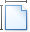
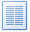

# General Tools: Page Layout
The **Page Layout** toolbar contains page layout options that include paper kind, margins and orientation.

These options are divided into the following categories.
* [Page Setup](#pagesetup)
* [Background](#pagebackground)

## <a name="pagesetup"/>Page Setup
| Command | Large&nbsp;Icon | Small&nbsp;Icon | Description |
|---|---|---|---|
| Margins |  |  | Sets the size of page margins for the current document section.You can select from a list of predefined margins, or invoke the **Page Setup** dialog and adjust the margin size manually. |
| Orientation |  |  | Sets the page orientation for the current document section. |
| Size |  |  | Sets the page size for the current document section. You can select one of the predefined page sizes from the list, or specify a custom page size in the **Page Setup** dialog. |
| Columns |  |  | Sets the number of columns for all pages in the current document section.You can also invoke the **Columns** dialog for more customization options. |
| Breaks |  |  | Inserts one of the available breaks (e.g., page break, column break or section break) at the carriage position. |
| Line&nbsp;Numbers |  |  | Displays line numbers in the current document section.You can select one of the predefined line numbering types from the list, or invoke the **Line Numbers** dialog to define custom line numbering. |

## <a name="pagebackground"/>Background
| Command | Large&nbsp;Icon | Small&nbsp;Icon | Description |
|---|---|---|---|
| Page Color |  |  | Sets a page color for the entire document. |