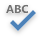

# General Tools: Review
The **Review** toolbar contains tools related to proofreading.

The following command is available in the **Proofing** section of this toolbar.

| Command | Large&nbsp;Icon | Small&nbsp;Icon | Description |
|---|---|---|---|
| Spelling |  |  | Checks the spelling of the document text. On detecting misspelled words, the **spell checker** invokes the **Spelling** dialog to type in the correct version, or select the correctly spelled word from the list of suggestions. |