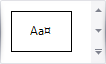

# Table Tools: Design
This toolbar is context sensitive, and becomes active after placing the text cursor in a document table.

The commands available in the **Design** toolbar of the **Table Tools** category are divided into the following sections.
* [Table Style Options](#tablestyleoptions)
* [Table Styles](#tablestyles)
* [Cell Styles](#tablecellstyles)
* [Borders &amp; Shadings](#bordersshadings)

## <a name="tablestyleoptions"/>Table Style Options
Commands from this category allow you to activate special formatting options for different table parts.

Special formatting options available for a table are defined in its table style. To create a new table style or modify an existing one, use the tools provided by the [Table Styles](#tablestyles) section of this category.

The following commands are available in the Table Style Options category.

| Command | Description |
|---|---|
| Header Row | Enables formatting of the first row in a table. |
| First Column | Enables special formatting for the first column in a table. |
| Total Row | Enables special formatting for the last row in a table. |
| Last Column | Enables special formatting for the last column in a table. |
| Banded Rows | Enables special formatting for odd and even rows in a table. |
| Banded Columns | Enables special formatting for odd and even columns in a table. |

## <a name="tablestyles"/>Table Styles
| Command | Image | Description |
|---|---|---|
| Table Styles |  | Sets a table style for the selected table. Creating a new table style or modifying an existing one invokes the **Modify Style** dialog, allowing you to specify a style name and adjust table formatting options (including special formatting options for different table parts). You can enable special formatting using commands from the [Table Style Options](#tablestyleoptions) section within this toolbar category. |

## <a name="tablecellstyles"/>Cell Styles
| Command | Image | Description |
|---|---|---|
| Cell Styles |  | Sets a cell style for the selected table cell. Creating a new table cell style or modifying an existing one invokes the **Modify Style** dialog, allowing you to specify a style name and adjust cell formatting options. |

## <a name="bordersshadings"/>Borders &amp; Shadings
| Command | Large Icon | Small Icon | Description |
|---|---|---|---|
| Line Style | none | none | Sets the style of a line that is used to draw borders. |
| Line Weight | none | none | Sets the width of the line that is used to draw borders. |
| Pen Color |  |  | Sets the color that is used to draw borders. |
| Borders |  |  | Draws the specified borders for selected cells. |
| Shading |  |  | Specifies the background color for the selected cells. |