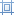

# Table Tools: Layout
This toolbar is context sensitive, and becomes active after placing the text cursor in a document table.

The commands available in the **Layout** toolbar of the **Table Tools** category are divided into the following sections.
* [Table](#table)
* [Rows &amp; Columns](#rowsandcolumns)
* [Merge](#merge)
* [Cell Size](#cellsize)
* [Alignment](#alignment)

## <a name="table"/>Table
| Command | Large Icon | Small Icon | Description |
|---|---|---|---|
| Select |  |  | Allows you to select a cell, row, column or table. |
| View Gridlines |  |  | Shows or hides table gridlines. This command is useful when working with tables that contain invisible borders. These lines are only displayed in the [Design Surface](../snap-application-elements/design-surface.md) - they do not appear in a published document. |
| Properties |  |  | Invokes the **Table Properties** dialog for the selected table. This dialog allows you to adjust the size and alignment properties of the current table cell, row, column or table. |

## <a name="rowsandcolumns"/>Rows &amp; Columns
| Command | Large Icon | Small Icon | Description |
|---|---|---|---|
| Delete |  |  | Deletes the specified cells or the currently selected row, column or table. To delete a single table cell, the **Delete Cells** dialog is invoked that allows you to select the "shift" mode for replacing the deleted cell. To remove individual rows from a **Snap List**, use the **Quick Filter** command of the [Data Tools: Field](data-tools-field.md) toolbar. |
| Insert Above |  |  | Inserts a new row above the selected row. |
| Insert Below |  |  | Inserts a new row below the selected row. |
| Insert Left |  |  | Inserts a new column to the left of the selected column. |
| Insert Right |  |  | Inserts a new column to the right of the selected column. |

## <a name="merge"/>Merge
| Command | Large Icon | Small Icon | Description |
|---|---|---|---|
| Merge Cells |  |  | Merges selected cells. The content of merged cells is converted to paragraphs of an output cell. |
| Split Cells |  |  | Splits the selected cell into a specified number of rows and columns. The content of the source cell is placed in the top-left output cell. |
| Split Table |  |  | Splits the table into two tables. The selected row becomes the first row of the new table. |

## <a name="cellsize"/>Cell Size
| Command | Large Icon | Small Icon | Description |
|---|---|---|---|
| AutoFit |  |  | Sets the auto fit mode of the selected table. The following auto fit modes are available: **AutoFit Contents** (table cells occupy the minimum width possible to fit content), **AutoFit Window** (the table occupies the entire width of the page), and **Fixed Column Width** (column width is fixed and can only be changed manually). |

## <a name="alignment"/>Alignment
| Command | Large Icon | Small Icon | Description |
|---|---|---|---|
| Alignment | none | none | Sets the text alignment for selected cells. |
| Cell Margins |  |  | Invokes the **Table Options** dialog, allowing you to set the default cell margins for the selected table cells. |