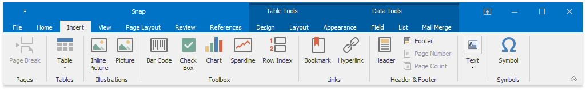

# Main Toolbar
The **Main Toolbar** in a Snap application provides quick access to the available document editing tools. The following toolbar styles are available:
1. [Ribbon](../../../ribbon.md)
	
	Tools are organized in various sections, contained in different tabs.
	
	
2. [Bars](../../../navigation-bars.md)
	
	Tools are organized in separate toolbars.
	
	