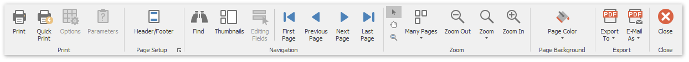
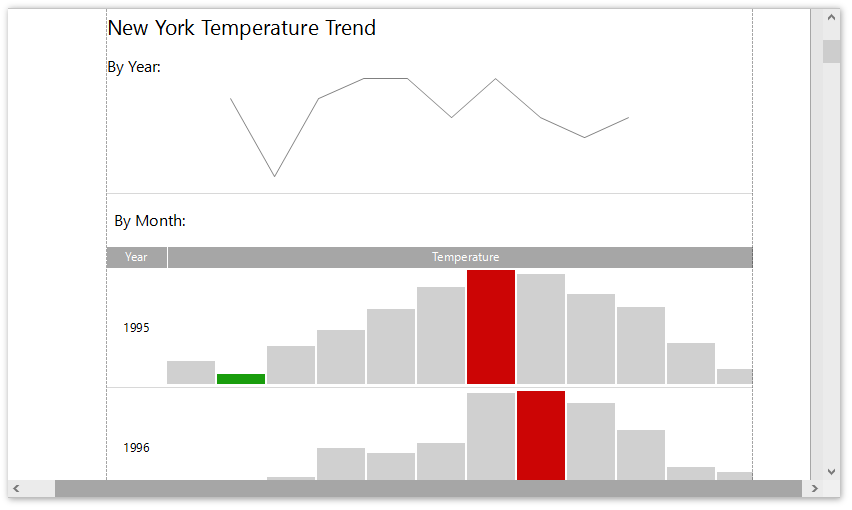
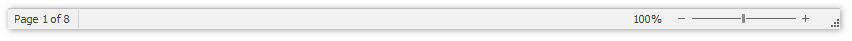
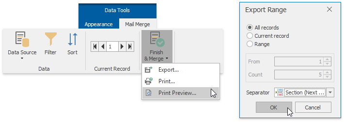

# Print Preview
This document describes the **Print Preview** window, which displays published documents in a **Snap** application.
* [Print Preview Elements](#elements)
* [Invoke a Print Preview](#invoke)

## <a name="elements"/>Print Preview Elements
The Print Preview displays a report document as it will appear on paper.

The user interface of the Print Preview window consists of the following elements.
* **Ribbon** - contains the document management and navigation commands divided into logical groups;
	
	
* **Document Pages Area** - displays a report document and provides vertical and horizontal scroll bars to navigate through the report.
	
	
* **Status Bar** - displays the page number of the currently selected page (out of a total number of pages), shows the progress bar while a document is being loaded, and enables document zooming.
	
	

## <a name="invoke"/>Invoke a Print Preview
* To assemble and preview a **tabular report**, click **Print Preview** in the [General Tools: File](../main-toolbar/general-tools-file.md) toolbar.
	
	
* Using the option above to preview a **mail merge report** will only display the document obtained from the first data source record.
	
	To assemble and preview a mail merge report, click **Finish &amp; Merge** in the [Data Tools: Mail Merge](../main-toolbar/data-tools-mail-merge.md) toolbar and select **Print Preview** in the invoked drop-down menu.
	
	
	
	In the invoked **Export Range** dialog, specify the required range of data records and click **OK**.