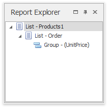

# Report Explorer
Report Explorer reflects the hierarchy of **fields** in a Snap document, to quickly navigate through its data levels. It displays the order of document lists, and lists their active groups in a tree format.

Clicking a node in the Report Explorer activates the corresponding document element that is closest to the currently displayed page.