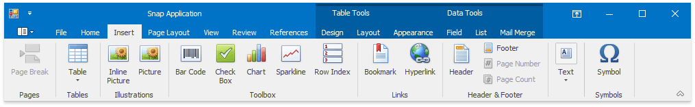
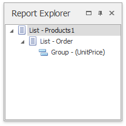

# Snap User Interface Overview
This document lists the essential elements of the Snap user interface, and provides links to specific topics that describe these elements in more detail.

The main elements of the Snap user interface are as follows.
* **[Main Toolbar](../../../../../interface-elements-for-desktop/articles/snap-reporting-engine/graphical-user-interface/snap-application-elements/main-toolbar.md)**
	
	The **Main Toolbar** in a Snap application provides quick access to the available document editing tools. The following toolbar styles are available:.
	1. [Ribbon](../../../../../interface-elements-for-desktop/articles/ribbon.md)
		
		Tools are organized in various sections, contained in different tabs.
		
		
	2. [Bars](../../../../../interface-elements-for-desktop/articles/navigation-bars.md)
		
		Tools are organized in separate toolbars.
		
		
* **[Design Surface](../../../../../interface-elements-for-desktop/articles/snap-reporting-engine/graphical-user-interface/snap-application-elements/design-surface.md)**
	
	The body of a report in the designer. In this region, you can design your report layout and immediately view the result.
	
	
* **[Data Explorer](../../../../../interface-elements-for-desktop/articles/snap-reporting-engine/graphical-user-interface/snap-application-elements/data-explorer.md)**
	
	Reflects the structure of available data, allowing you to manage a report's data sources. You can add the data shown in this pane to your report via drag-and-drop.
	
	
* **[Report Explorer](../../../../../interface-elements-for-desktop/articles/snap-reporting-engine/graphical-user-interface/snap-application-elements/report-explorer.md)**
	
	Reflects the hierarchy of the elements of a Snap document.
	
	