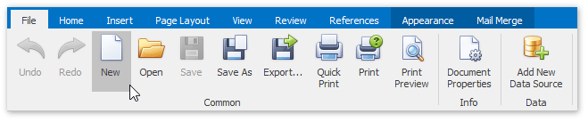

# Create a New Report
To create a new Snap report, click the **New** button on the **File** tab of the Snap application's ribbon toolbar.

A  new Snap report will be created and opened in the editor.