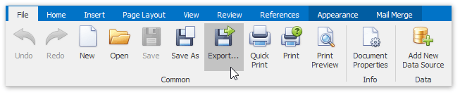

# Export a Report
In addition to native .snx file format, Snap allows you to export reports into the one of the wide variety of third-party formats, (e.g., PDF, HTML or DOCX).

To export a Snap report in a third-party format, do the following.
1. Click the **Export Document** button on the **File** tab of the Snap application's ribbon toolbar.
	
	
2. In the invoked **Save As** dialog,  select a directory in which you want to save, specify the name and format of the exported file, and click **Save** to export the report and exit the dialog.
	
	