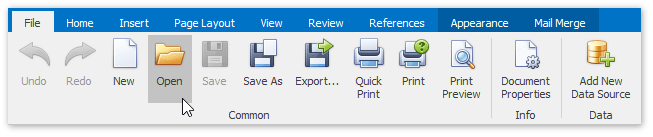

# Open an Existing Report
To open an existing report, click the **Open** button on the **File** tab of the Snap application's ribbon toolbar.

In the invoked **Open** dialog, select a file and click **Open**.

