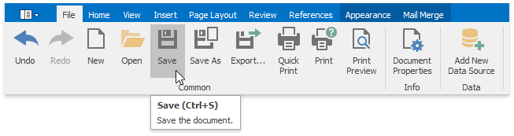
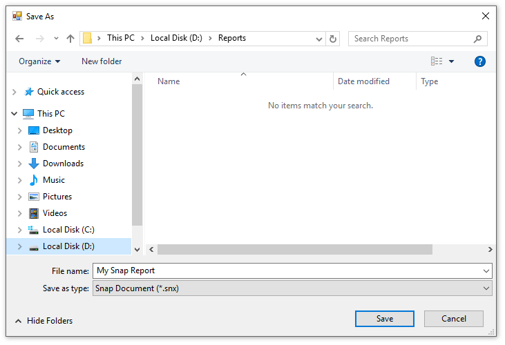
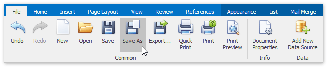

# Save a Report
To save a report to a file, click the **Save** button on the **File** tab of the Snap application's ribbon toolbar.

If you are saving a new report, the **Save As** dialog will be invoked. In the invoked dialog, specify the name and directory for the new report file and click **Save**.

To save a changed copy of an existing report to a separate file, click the **Save As** button in the **File** tab of the ribbon toolbar.

