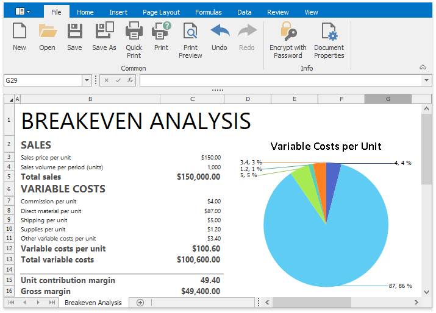

This section describes the capabilities provided by the **Spreadsheet**.

**Spreadsheet UI**
* [Ribbon Interface](../../interface-elements-for-desktop/articles/spreadsheet/spreadsheet-ui/ribbon-interface.md)
* [Spreadsheet Elements](../../interface-elements-for-desktop/articles/spreadsheet/spreadsheet-ui/spreadsheet-elements.md)

**File Operations**
* [Create a Workbook](../../interface-elements-for-desktop/articles/spreadsheet/file-operations/create-a-workbook.md)
* [Load a Workbook](../../interface-elements-for-desktop/articles/spreadsheet/file-operations/load-a-workbook.md)
* [Create a Worksheet](../../interface-elements-for-desktop/articles/spreadsheet/file-operations/create-a-worksheet.md)
* [Rename a Worksheet](../../interface-elements-for-desktop/articles/spreadsheet/file-operations/rename-a-worksheet.md)
* [Delete a Worksheet](../../interface-elements-for-desktop/articles/spreadsheet/file-operations/delete-a-worksheet.md)
* [Save a Workbook](../../interface-elements-for-desktop/articles/spreadsheet/file-operations/save-a-workbook.md)
* [Import and Export Text Files](../../interface-elements-for-desktop/articles/spreadsheet/file-operations/import-and-export-text-files.md)
* [Print a Workbook](../../interface-elements-for-desktop/articles/spreadsheet/file-operations/print-a-workbook.md)
* [Adjust Page Settings](../../interface-elements-for-desktop/articles/spreadsheet/file-operations/adjust-page-settings.md)
* [Undo and Redo Last Actions](../../interface-elements-for-desktop/articles/spreadsheet/file-operations/undo-and-redo-last-actions.md)

**Viewing and Navigating**
* [Hide and Display Worksheets](../../interface-elements-for-desktop/articles/spreadsheet/viewing-and-navigating/hide-and-display-worksheets.md)
* [Zoom a Worksheet](../../interface-elements-for-desktop/articles/spreadsheet/viewing-and-navigating/zoom-a-worksheet.md)
* [Hide Gridlines and Headings](../../interface-elements-for-desktop/articles/spreadsheet/viewing-and-navigating/hide-gridlines-and-headings.md)
* [Freeze Columns and Rows](../../interface-elements-for-desktop/articles/spreadsheet/viewing-and-navigating/freeze-columns-and-rows.md)

**Editing Cells**
* [Select Cells or Cell Content](../../interface-elements-for-desktop/articles/spreadsheet/editing-cells/select-cells-or-cell-content.md)
* [Copy and Paste Cell Content](../../interface-elements-for-desktop/articles/spreadsheet/editing-cells/copy-and-paste-cell-content.md)
* [Fill Data Automatically](../../interface-elements-for-desktop/articles/spreadsheet/editing-cells/fill-data-automatically.md)
* [Find and Replace](../../interface-elements-for-desktop/articles/spreadsheet/editing-cells/find-and-replace.md)
* [Insert a Comment](../../interface-elements-for-desktop/articles/spreadsheet/editing-cells/insert-a-comment.md)
* [Insert a Symbol](../../interface-elements-for-desktop/articles/spreadsheet/editing-cells/insert-a-symbol.md)

**Cell Formatting**
* [Format Cells](../../interface-elements-for-desktop/articles/spreadsheet/cell-formatting/format-cells.md)
* [Format Cell Content](../../interface-elements-for-desktop/articles/spreadsheet/cell-formatting/format-cell-content.md)
* [Wrap Text and Merge Cells](../../interface-elements-for-desktop/articles/spreadsheet/cell-formatting/wrap-text-and-merge-cells.md)
* [Number Formatting](../../interface-elements-for-desktop/articles/spreadsheet/cell-formatting/number-formatting.md)
* [Conditional Formatting ](../../interface-elements-for-desktop/articles/spreadsheet/cell-formatting/conditional-formatting.md)
* [Clear Cell Formatting](../../interface-elements-for-desktop/articles/spreadsheet/cell-formatting/clear-cell-formatting.md)

**Columns and Rows**
* [Insert and Delete Columns and Rows](../../interface-elements-for-desktop/articles/spreadsheet/columns-and-rows/insert-and-delete-columns-and-rows.md)
* [Show and Hide Columns and Rows](../../interface-elements-for-desktop/articles/spreadsheet/columns-and-rows/show-and-hide-columns-and-rows.md)
* [Specify Column Width and Row Height](../../interface-elements-for-desktop/articles/spreadsheet/columns-and-rows/specify-column-width-and-row-height.md)

**Tables**
* [Create a Table ](../../interface-elements-for-desktop/articles/spreadsheet/tables/create-a-table.md)

**Pivot Tables**
* [Create a Pivot Table](../../interface-elements-for-desktop/articles/spreadsheet/pivot-tables/create-a-pivot-table.md)
* [Modify a Pivot Table](../../interface-elements-for-desktop/articles/spreadsheet/pivot-tables/modify-a-pivot-table.md)
* [Refresh the PivotTable Data](../../interface-elements-for-desktop/articles/spreadsheet/pivot-tables/refresh-the-pivottable-data.md)
* [Change the PivotTable Layout](../../interface-elements-for-desktop/articles/spreadsheet/pivot-tables/change-the-pivottable-layout.md)
* [Apply a Predefined Style to a Pivot Table](../../interface-elements-for-desktop/articles/spreadsheet/pivot-tables/apply-a-predefined-style-to-a-pivot-table.md)
* [Change the PivotTable Layout](../../interface-elements-for-desktop/articles/spreadsheet/pivot-tables/change-the-pivottable-layout.md)
* [Subtotal and Total Fields in a Pivot Table](../../interface-elements-for-desktop/articles/spreadsheet/pivot-tables/subtotal-and-total-fields-in-a-pivot-table.md)
* [Group Items in a Pivot Table ](../../interface-elements-for-desktop/articles/spreadsheet/pivot-tables/group-items-in-a-pivot-table.md)
* [Sort Items in a Pivot Table](../../interface-elements-for-desktop/articles/spreadsheet/pivot-tables/sort-items-in-a-pivot-table.md)
* [Filter a Pivot Table ](../../interface-elements-for-desktop/articles/spreadsheet/pivot-tables/filter-a-pivot-table.md)
* [Insert a Calculated Field and Calculated Item](../../interface-elements-for-desktop/articles/spreadsheet/pivot-tables/insert-a-calculated-field-and-calculated-item.md)

**Data Analysis and Presentation**
* [Outline Data](../../interface-elements-for-desktop/articles/spreadsheet/data-presentation/outline-data.md)
* [Subtotal Data](../../interface-elements-for-desktop/articles/spreadsheet/data-presentation/subtotal-data.md)
* [Sort Data](../../interface-elements-for-desktop/articles/spreadsheet/data-presentation/sort-data.md)
* [Filter Data](../../interface-elements-for-desktop/articles/spreadsheet/data-presentation/filter-data.md)

**Protection**
* [Protect a Workbook](../../interface-elements-for-desktop/articles/spreadsheet/protection/protect-a-workbook.md)
* [Protect a Worksheet](../../interface-elements-for-desktop/articles/spreadsheet/protection/protect-a-worksheet.md)
* [Protect Worksheet Ranges](../../interface-elements-for-desktop/articles/spreadsheet/protection/protect-worksheet-ranges.md)
* [Encrypt a Workbook with the Password](../../interface-elements-for-desktop/articles/spreadsheet/protection/encrypt-a-workbook-with-the-password.md)

**Data Validation**
* [Validate Data in Cells](../../interface-elements-for-desktop/articles/spreadsheet/data-validation/validate-data-in-cells.md)

**Formulas**
* [Create a Simple Formula](../../interface-elements-for-desktop/articles/spreadsheet/formulas/create-a-simple-formula.md)
* [Cell References](../../interface-elements-for-desktop/articles/spreadsheet/formulas/cell-references.md)
* [Defined Names](../../interface-elements-for-desktop/articles/spreadsheet/formulas/defined-names.md)
* [Using Functions in Formulas ](../../interface-elements-for-desktop/articles/spreadsheet/formulas/using-functions-in-formulas.md)
* [Supported Functions](../../interface-elements-for-desktop/articles/spreadsheet/formulas/supported-functions.md)
* [Create an Array Formula ](../../interface-elements-for-desktop/articles/spreadsheet/formulas/create-an-array-formula.md)
* [Error Types in Formulas](../../interface-elements-for-desktop/articles/spreadsheet/formulas/error-types-in-formulas.md)

**Charting**
* [Charting Overview](../../interface-elements-for-desktop/articles/spreadsheet/charting/charting-overview.md)
* [Creating a Chart](../../interface-elements-for-desktop/articles/spreadsheet/charting/creating-a-chart.md)
* [Changing a Chart Type](../../interface-elements-for-desktop/articles/spreadsheet/charting/changing-a-chart-type.md)
* [Applying a Predefined Chart Layout and Style](../../interface-elements-for-desktop/articles/spreadsheet/charting/applying-a-predefined-chart-layout-and-style.md)
* [Modifying a Chart Manually](../../interface-elements-for-desktop/articles/spreadsheet/charting/modifying-a-chart-manually.md)

**Mail Merge**
* [Mail Merge Overview](../../interface-elements-for-desktop/articles/spreadsheet/mail-merge/mail-merge-overview.md)
* [Data Source Wizard](../../interface-elements-for-desktop/articles/spreadsheet/mail-merge/data-source-wizard.md)
* [Query Builder](../../interface-elements-for-desktop/articles/spreadsheet/mail-merge/query-builder.md)
* [Parameters Panel](../../interface-elements-for-desktop/articles/spreadsheet/mail-merge/parameters-panel.md)

**Pictures and Hyperlinks**
* [Insert a Picture](../../interface-elements-for-desktop/articles/spreadsheet/pictures-and-hyperlinks/insert-a-picture.md)
* [Move, Rotate and Resize a Picture](../../interface-elements-for-desktop/articles/spreadsheet/pictures-and-hyperlinks/move-rotate-and-resize-a-picture.md)
* [Insert and Delete Hyperlinks](../../interface-elements-for-desktop/articles/spreadsheet/pictures-and-hyperlinks/insert-and-delete-hyperlinks.md)
* [Shortcuts to Work with Pictures](../../interface-elements-for-desktop/articles/spreadsheet/pictures-and-hyperlinks/shortcuts-to-work-with-pictures.md)

**Keyboard Shortcuts**
* [File Operations](../../interface-elements-for-desktop/articles/spreadsheet/keyboard-shortcuts/file-operations.md)
* [Navigation inside Worksheets](../../interface-elements-for-desktop/articles/spreadsheet/keyboard-shortcuts/navigation-inside-worksheets.md)
* [Work with Selections ](../../interface-elements-for-desktop/articles/spreadsheet/keyboard-shortcuts/work-with-selections.md)
* [Copy, Paste and Edit the Cell Content](../../interface-elements-for-desktop/articles/spreadsheet/keyboard-shortcuts/copy-paste-and-edit-the-cell-content.md)
* [Cell Formatting ](../../interface-elements-for-desktop/articles/spreadsheet/keyboard-shortcuts/cell-formatting.md)
* [Work with Columns and Rows](../../interface-elements-for-desktop/articles/spreadsheet/keyboard-shortcuts/work-with-columns-and-rows.md)
* [Sort and Filter](../../interface-elements-for-desktop/articles/spreadsheet/keyboard-shortcuts/sort-and-filter.md)
* [Work with Formulas](../../interface-elements-for-desktop/articles/spreadsheet/keyboard-shortcuts/work-with-formulas.md)