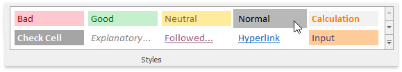

# Clear Cell Formatting
To remove all formatting from cells, do one of the following.
1. In the **Editing** group within the **Home** tab, click the **Clear** button, and select **Clear Formats** from the drop-down menu.
	
	
2. In the **Styles** group within the **Home** tab, select the _Normal_ style, to restore the default settings.
	 
	
	