# Conditional Formatting
The **Spreadsheet** allows you to apply **conditional formatting** to a range of cells. Conditional formatting changes the appearance of individual cells based on specific conditions. It helps to highlight critical information, or describe trends within cells by using data bars, color scales and built-in icon sets. To create a conditional format, select the cell range to which you wish to apply a conditional formatting rule. On the **Home** tab, in the **Styles** group, click the **Conditional Formatting** button to display a drop-down list of available conditional formats. You can do one of the following.
* [Format Cells that are Less than, Greater than or Equal to a Value](#relationaloperator)
* [Format Cells that Contain Text or a Date](#text)
* [Format Unique or Duplicate Cells](#uniquevalues)
* [Format Top or Bottom Ranked Values](#rank)
* [Format Cells whose Values are Above or Below the Average](#average)
* [Format Cells Using Data Bars](#databars)
* [Format Cells using Color Scales](#colorscales)
* [Format Cells using Icon Sets](#iconsets)
* [Edit Conditional Formatting Rules](#manage)
* [Clear Conditional Formatting Rules](#clearrules)

## <a name="relationaloperator"/>Format Cells that are Less than, Greater than or Equal to a Value
To highlight cells whose values meet the criterion represented by a relational operator (=, &#60;, &#62;), do the following.
* Select the cell range to which you wish to apply a conditional format.
* On the **Home** tab, in the **Styles** group, select **Conditional Formatting** | **Highlight Cells Rules**, and then select one of the following items: **Greater Than...**, **Less Than...**, **Between...** or **Equal To...**
	
	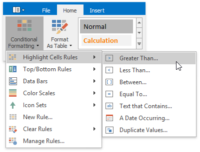
* In the invoked dialog, specify the threshold value, and select formatting options to be applied to cells that meet the condition. Note that you can also use a formula to specify the threshold value. If you enter a formula, start it with an equal sign (=). If a formula returns an error, formatting options will not be applied.
	
	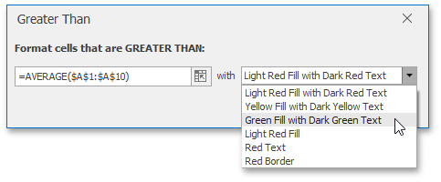
* If none of the built-in formatting options meet your requirements, you can create a custom formatting rule. On the **Home** tab, in the **Styles** group, select **Conditional Formatting** | **New Rule...**
	
	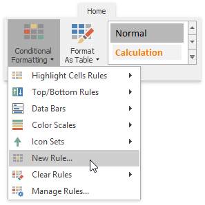
* ...or select **Conditional Formatting** | **Manage Rules...** and click the **New Rule...** button in the invoked **Conditional Formatting Rules Manager**.
	
	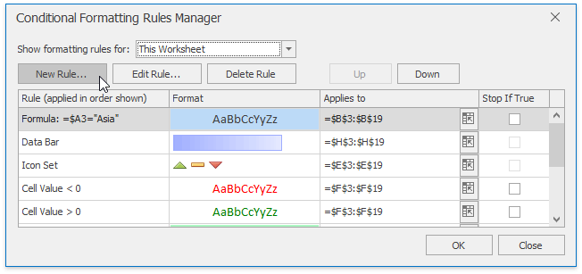
* In the invoked **New Formatting Rule** dialog, select **Format only cells that contain** from the **Select a Rule Type** list.
* In the **Edit Rule Description** section, select the target relational operator from the drop-down menu and specify the threshold values.
	
	To set the formatting options to be applied to cells that meet the condition, click the **Format** button to invoke the **Format Cells** dialog. When the formatting options are defined, the resulting cell appearance is displayed in the **Preview** box.
	
	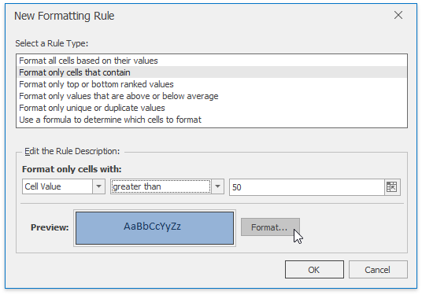

## <a name="text"/>Format Cells that Contain Text or a Date
To highlight cells that contain the specified text string or time period, do the following:
* Select the cell range to which you wish to apply a conditional format.
* On the **Home** tab, in the **Styles** group, select **Conditional Formatting** | **Highlight Cells Rules**, and then click **Text that Contains...** or **A Date Occurring...**.
	
	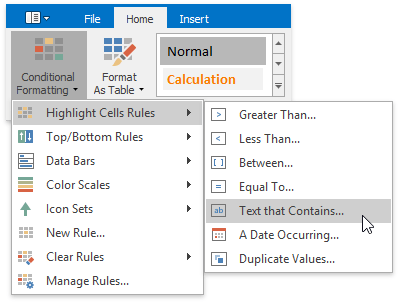
* In the invoked dialog, specify the text string (if you selected **Text that Contains...**) or time period (if you selected **A Date Occurring...**) to be highlighted, and select the formatting options to be applied to cells that meet the condition.
	
	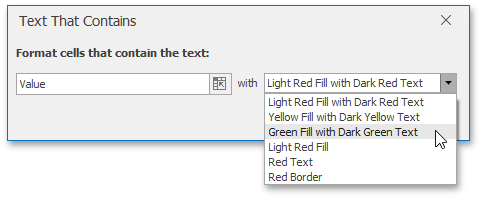
	
	Note that for the **Text that Contains...** rule, you can also specify a formula that returns text. If you enter a formula, start it with an equal sign (=). If a formula returns an error, formatting options will not be applied.
* If none of the built-in formatting options meet your requirements, you can create a custom formatting rule. On the **Home** tab, in the **Styles** group, select **Conditional Formatting** | **New Rule...**
	
	
* ...or select **Conditional Formatting** | **Manage Rules...** and click the **New Rule...** button in the invoked **Conditional Formatting Rules Manager**.
	
	
* In the invoked **New Formatting Rule** dialog, select **Format only cells that contain** from the **Select a Rule Type** list.
* In the **Edit Rule Description** section, select the target cell content, set the format operator and the text string (if you selected **Specific Text**) or specify the time period (if you selected **Dates Occurring**).
	
	To set the formatting options to be applied to cells that meet the condition, click the **Format** button to invoke the **Format Cells** dialog. When the formatting options are defined, the resulting cell appearance is displayed in the **Preview** box.
	
	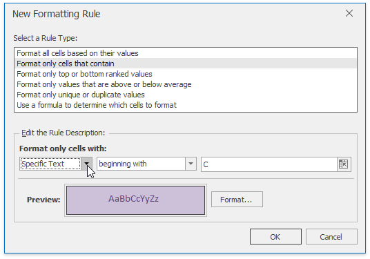

## <a name="uniquevalues"/>Format Unique or Duplicate Cells
To find unique or duplicate values in a range of cells, do the following:
* Select the cell range to which you wish to apply a conditional format.
* On the **Home** tab, in the **Styles** group, select **Conditional Formatting** | **Highlight Cells Rules** | **Duplicate Values...**
	
	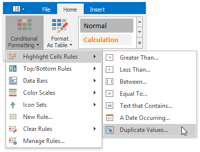
* In the invoked dialog, specify whether you wish to highlight unique or duplicate values, and select the formatting options to be applied to cells that meet the condition.
	
	
* If none of the built-in formatting options meet your requirements, you can create a custom formatting rule. On the **Home** tab, in the **Styles** group, select **Conditional Formatting** | **New Rule...**
	
	
* ...or select **Conditional Formatting** | **Manage Rules...** and click the **New Rule...** button in the invoked **Conditional Formatting Rules Manager**.
	
	
* In the invoked **New Formatting Rule** dialog, select **Format only unique or duplicate values** from the **Select a Rule Type** list.
* In the **Edit Rule Description** section, specify whether you wish to highlight unique or duplicate values. To set the formatting options to be applied to cells that meet the condition, click the **Format** button to invoke the **Format Cells** dialog. When the formatting options are defined, the resulting cell appearance is displayed in the **Preview** box.
	
	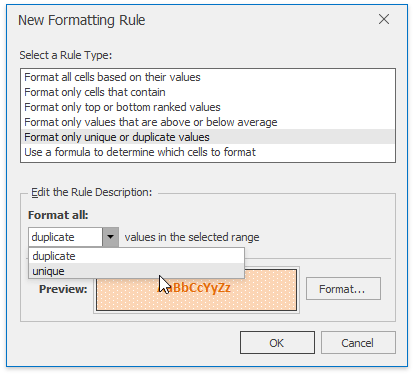

## <a name="rank"/>Format Top or Bottom Ranked Values
To highlight only the top or bottom ranked values in a range of cells, do the following:
* Select the cell range to which you wish to apply a conditional format.
* On the **Home** tab, in the **Styles** group, select **Conditional Formatting** | **Top/Bottom Rules**, and then select one of the following items: **Top 10 Items...**, **Top 10%...**, **Bottom 10 Items...** or **Bottom 10%...**
	
	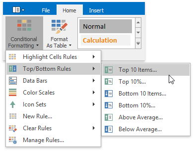
* In the invoked dialog, specify the number or percentage of the rank value (depending on the selected rule), and select the formatting options to be applied to cells that meet the condition.
	
	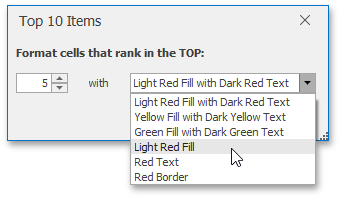
* If none of the built-in formatting options meet your requirements, you can create a custom formatting rule. On the **Home** tab, in the **Styles** group, select **Conditional Formatting** | **New Rule...**
	
	
* ...or select **Conditional Formatting** | **Manage Rules...** and click the **New Rule...** button in the invoked **Conditional Formatting Rules Manager**.
	
	
* In the invoked **New Formatting Rule** dialog, select **Format only top or bottom ranked values** from the **Select a Rule Type** list.
* In the **Edit Rule Description** section, specify whether you wish to highlight top or bottom values and enter the rank value number. To convert the number to percentage, check the **% of the selected range** box.
	
	To set the formatting options to be applied to cells that meet the condition, click the **Format** button to invoke the **Format Cells** dialog. When the formatting options are defined, the resulting cell appearance is displayed in the **Preview** box.
	
	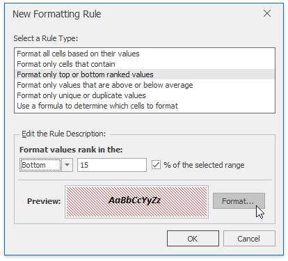

## <a name="average"/>Format the Cells whose Values are Above or Below the Average
To highlight values that are above or below the average in a range of cells, do the following:
* Select the cell range to which you wish to apply a conditional format.
* On the **Home** tab, in the **Styles** group, select **Conditional Formatting** | **Top/Bottom Rules**, and then click **Above Average...** or **Below Average...**
	
	
* In the invoked dialog, select the formatting options to be applied to cells that meet the condition.
	
	
* If none of the built-in formatting options meet your requirements, you can create a custom formatting rule. On the **Home** tab, in the **Styles** group, select **Conditional Formatting** | **New Rule...**
	
	
* ...or select **Conditional Formatting** | **Manage Rules...** and click the **New Rule...** button in the invoked **Conditional Formatting Rules Manager**.
	
	
* In the invoked **New Formatting Rule** dialog, select the **Format only values that are above or below average** type for the new rule from the **Select a Rule Type** list.
* In the **Edit Rule Description** section, select the format operator from the **Show values that are:** list.
	
	To set the formatting options to be applied to cells that meet the condition, click the **Format** button to invoke the **Format Cells** dialog. When the formatting options are defined, the resulting cell appearance is displayed in the **Preview** box.
	
	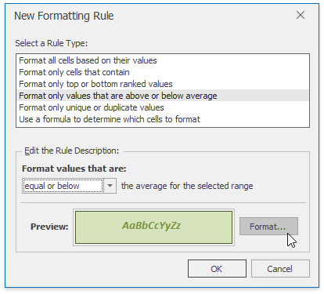

## <a name="databars"/>Format Cells using Data Bars
The data bar conditional formatting rule draws a shaded bar in the background of each cell in the range to which the rule is applied. The length of the data bar represents the cell value. A longer bar represents a higher value, and a shorter bar represents a lower value. For example, the image below shows the markup magnitude using solid light-green data bars.

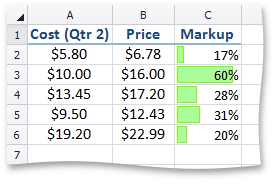

To apply a data bar conditional formatting rule, do the following:
* On the **Home** tab, in the **Styles** group, choose **Conditional Formatting** | **Data Bars**, and then select the desired color for a gradient or solid data bar.
	
	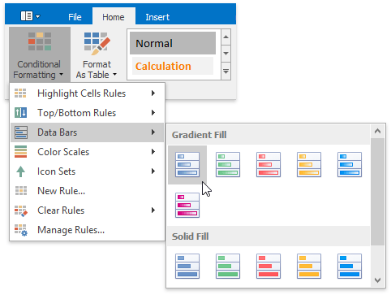
* If none of the built-in formatting options meet your requirements, you can create a custom formatting rule. On the **Home** tab, in the **Styles** group, select **Conditional Formatting** | **New Rule...**
	
	
* ...or select **Conditional Formatting** | **Manage Rules...** and click the **New Rule...** button in the invoked **Conditional Formatting Rules Manager**.
	
	
* In the invoked **New Formatting Rule** dialog, select the **Format cells based on their values** type from the **Select a Rule Type** list.
* In the **Edit Rule Description** section, select **Data Bar** from the **Format style:** list.
* Specify the minimum and maximum thresholds type and value (if necessary). To disable showing values in the cells to which the formatting rule is applied, check the **Show bar only** box.
	
	Customize the bar appearance by setting the fill type, fill color, border type and color in the **Bar Appearance:** section. The resulting data bar appearance is displayed in the **Preview** box.
	
	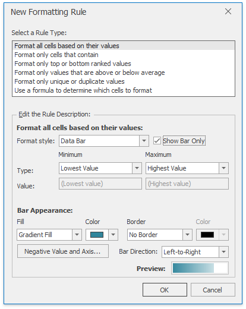
	
	To specify the negative bar and axis appearance settings, click the **Negative Value and Axis...** button. The invoked **Negative Value and Axis Settings** dialog allows you to set the negative bar fill and border color, specify axis color and position within the cell.
	
	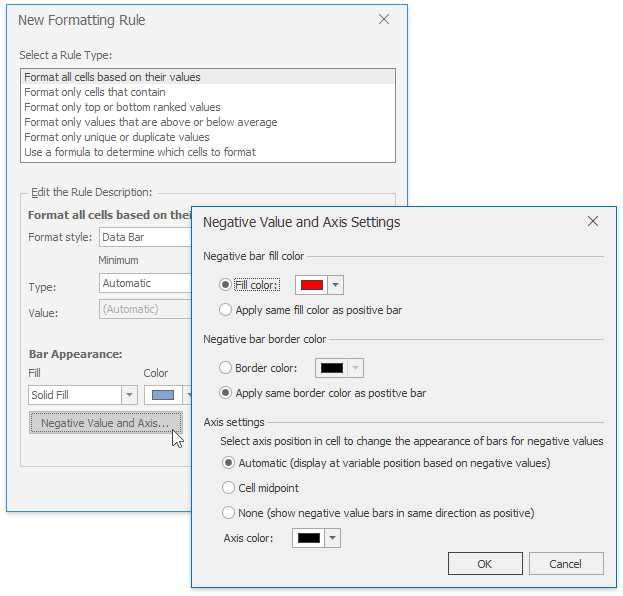

## <a name="colorscales"/>Format Cells using Color Scales
Color scales compare values using a gradation of two or three colors. The shade of the color represents higher, middle and lower values in the cell range to which the rule is applied. For example, the image below shows a price distribution using a gradation of three colors. Red represents the lower values, yellow represents the medium values and sky blue represents the higher values.

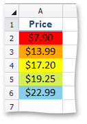

To create a color scale, do the following:
* On the **Home** tab, in the **Styles** group, choose **Conditional Formatting** | **Color Scales**, and then select one of the predefined color combinations.
	
	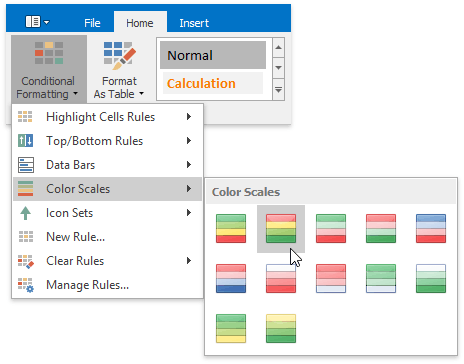
* If none of the built-in formatting options meet your requirements, you can create a custom formatting rule. On the **Home** tab, in the **Styles** group, select **Conditional Formatting** | **New Rule...**
	
	
* ...or select **Conditional Formatting** | **Manage Rules...** and click the **New Rule...** button in the invoked **Conditional Formatting Rules Manager**.
	
	
* In the invoked **New Formatting Rule** dialog, select the **Format cells based on their values** type from the **Select a Rule Type** list.
* In the **Edit Rule Description** section, select **2-** or **3-Color Scale** from the **Format style:** list.
	
	Specify the type of the minimum, midpoint (if the 3-color scale style is selected) and the maximum threshold, enter their values (if necessary) and select the corresponding colors. The resulting cell appearance is displayed in the **Preview** box.
	
	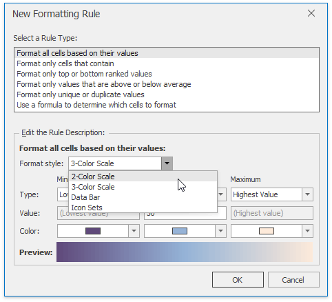

## <a name="iconsets"/>Format Cells using Icon Sets
An icon set conditional format classifies data in a range into three to five categories. The **Spreadsheet** divides the range into equal parts based on the number of icons in the selected set and applies an icon to each cell depending on its value. For example, the image below shows the value ranking. A filled star represents values that are greater than or equal to 67 percent, a half-filled star represents values that are less than 67 percent and greater than or equal to 33 percent, and an empty star shows values that are less than 33 percent.

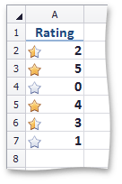

To apply an icon set conditional formatting rule, do the following:
* On the **Home** tab, in the **Styles** group, choose **Conditional Formatting** | **Icon Sets**, and then select the desired icon set from the gallery.
	
	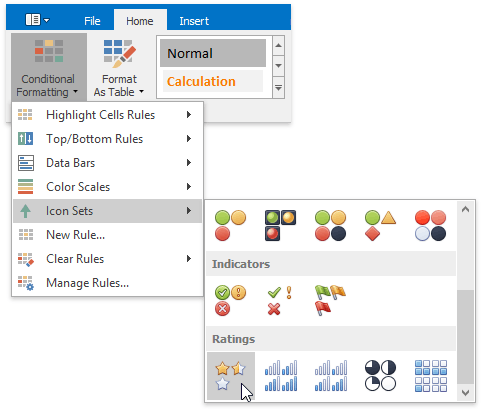
* If none of the built-in formatting options meet your requirements, you can create a custom formatting rule. On the **Home** tab, in the **Styles** group, select **Conditional Formatting** | **New Rule...**
	
	
* ...or select **Conditional Formatting** | **Manage Rules...** and click the **New Rule...** button in the invoked **Conditional Formatting Rules Manager**.
	
	
* In the invoked **New Formatting Rule** dialog, select the **Format cells based on their values** type from the **Select a Rule Type** list.
* In the **Edit Rule Description** section, select **Icon Sets** from the **Format style:** list.
* You can select the whole icon set in the **Icon Style** list or select each icon individually in the **Icon** section. Check **Show Icon Only** box to disable showing cell values. To show icons in the reverse order, click **Reverse Icon Order** button.
	
	Select the minimum and maximum threshold type and change values if necessary in the corresponding **Value** boxes. The resulting rule is shown in the **Display each icon according to these rules:** section.
	
	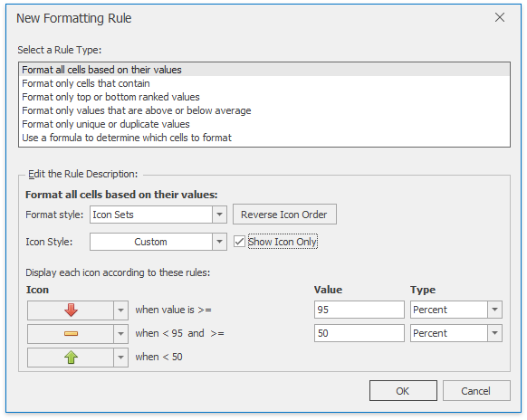

## <a name="manage"/>Edit the Conditional Formatting Rule
You can modify existing conditional formatting rules by doing the following:
* On the **Home** tab, in the **Styles** group, click **Conditional Formatting** | **Manage Rules...**
	
	
* In the invoked **Conditional Formatting Rules Manager**, select the part of the document whose formatting rules should be displayed by selecting one of the available areas from the **Show formatting rules for:** drop-down list.
	
	
* To edit the desired rule, select it within the list and click **Edit Rule...** button.
* To apply the selected formatting rule to another cell range, type the cell reference in the **Applies to** column cell or select the cell range directly in the worksheet by clicking the **Collapse Dialog**
	
	 button.
* The formatting rules are shown in order of precedence. A new formatting rule is automatically added to the top of the list and has the highest precedence. To change the precedence of a desired formatting rule, use **Up** and **Down** buttons.
	
	You can disable applying the formatting rules lower in precedence if the current rule condition is **true**. To do that, check the **Stop if True** box. Note that this options is unavailable for the rules that format cells using data bars, color scales or icon sets.
	
	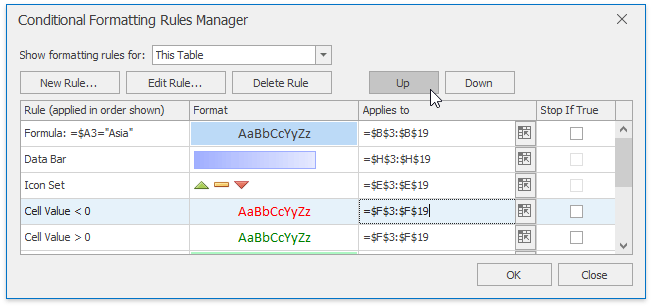

## <a name="clearrules"/>Clear Conditional Formatting Rules
To delete a conditional formatting rule, do one of the following:
* Select the range that contains the conditional formatting rules you wish to clear. On the **Home** tab, in the **Styles** group, select **Conditional Formatting** | **Clear Rules** | **Clear Rules from Selected Cells** to delete the rules applied to the selected range.
* Invoke the **Conditional Formatting Rules Manager**, select the rule you wish to clear and click **Delete Rule** button.
* To clear all conditional formatting rules on a worksheet, select **Conditional Formatting** | **Clear Rules** | **Clear Rules from Entire Sheet**.